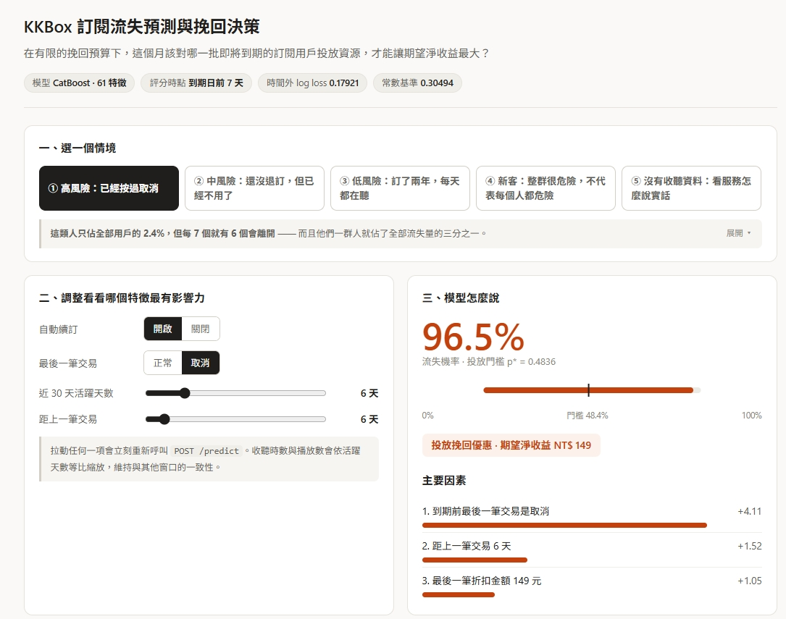
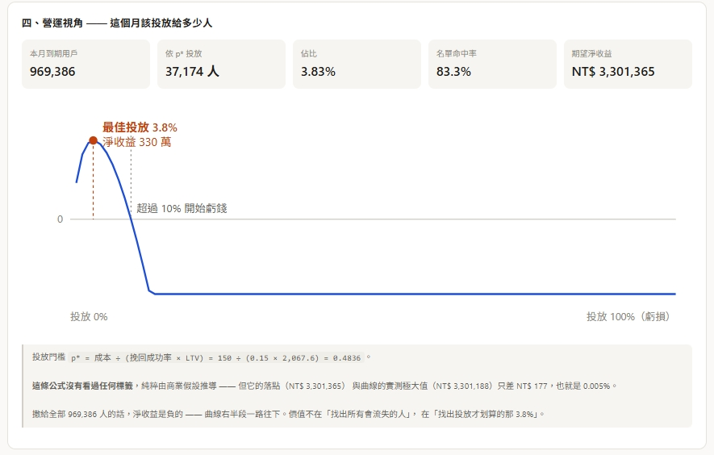
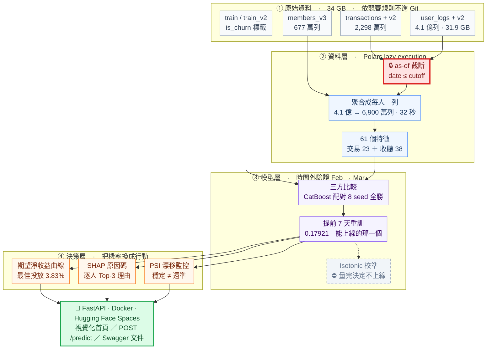
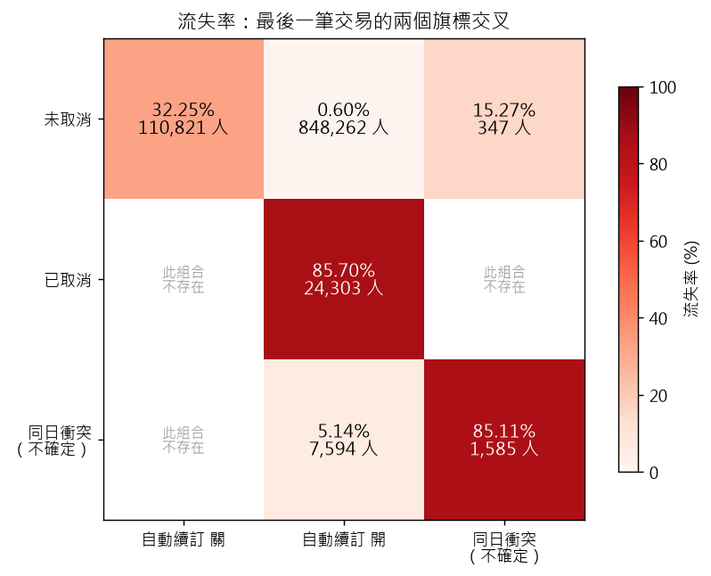

# 完整發現：M0 – M6

> 這是 [README](README.md) 的完整版。每個里程碑的實測數字、消融實驗、洩漏審查，以及**做完之後被自己的量測推翻的計畫**，都完整保留在這裡。
>
> 每一節的數字都可以用對應的 `make` 指令重現（指令表見[快速開始](#快速開始)）。

---

## 線上 Demo：先看成果

### 👉 **https://huggingface.co/spaces/lee851104/kkbox-demo**

一個頁面、兩個視角：上半部是**一個人**，下半部是**一整個月**。

[](https://huggingface.co/spaces/lee851104/kkbox-demo)

### 上半部：選一個情境，拉滑桿看機率怎麼動

從最安全的用戶開始，一次只改一個訊號：

| 操作 | 流失機率 | 決策 | Top-1 原因 |
|---|---|---|---|
| ③ 低風險：訂了兩年，每天都在聽 | **0.3%** | 不投放 | 最後一筆方案定價 149 元 |
| └ 關掉自動續訂 | 3.6% | 不投放 | 未開啟自動續訂 |
| └ 再改成已取消 | 30.9% | 不投放 | 到期前最後一筆交易是取消 |
| └ 近 30 天活躍天數歸零 | **74.5%** | **投放** | 到期前最後一筆交易是取消 |

⚠️ **請注意第三列**：流失機率已經 30.9%，決策仍然是「不投放」—— 因為投放門檻是 `p* = 48.4%`。**「風險高」與「值得花錢」是兩件事**，而那條分界線正是這個專案要交付的東西。

⚠️ **後兩列頁面上會跳出一條警告**，因為那個組合在訓練資料裡一筆都沒有：沒開自動續訂的人不需要取消，時間到就自然結束（見 [M0 的交叉熱圖](#這兩個旗標不是獨立的一個是狀態一個是動作)）。兩個開關獨立，所以使用者切得出真實資料做不到的組合，而**模型仍會回一個看起來完全合理的機率** —— 那是外推，不是它學過的東西。與其擋住它，不如在它發生的當下講清楚。

每拉一次滑桿都會**重新呼叫一次 `POST /predict`**，頁面上沒有任何預先算好的數字。

[](https://huggingface.co/spaces/lee851104/kkbox-demo)

### 下半部：同一個模型套到整個月

本月 969,386 位到期用戶，依門檻 `p*` 該投放 **37,174 人（3.83%）**，名單命中率 **83.3%**，期望淨收益 **NT$ 3,301,365**。曲線右半段一路往下 —— **撒給全部人是負的**。

> 那條門檻 `p* = 成本 ÷ (挽回成功率 × LTV)` **沒有看過任何標籤**，純粹由三個商業假設推導。但它的落點與期望淨收益曲線的實測極大值只差 **NT$ 177（0.005%）**。

### 🔧 API 技術文件：**https://lee851104-kkbox-demo.hf.space/docs**

Swagger UI。點 **POST /predict** → **Try it out** → 下拉選單挑情境 → **Execute**，看得到完整的請求／回應結構與所有欄位定義：

| 範例情境 | 輸出機率 | 該不該投放挽回優惠 |
|---|---|---|
| ① 高風險：已經按過取消 | **0.9652** | ✅ 投放，期望淨收益 +149 元 |
| ⑤ 沒有收聽資料：看服務怎麼說實話 | 0.7502 | ✅ 投放，+83 元 |
| ② 中風險：還沒退訂，但已經不用了 | 0.1997 | ❌ 不投放，−88 元 |
| ④ 新客：整群很危險，不代表每個人都危險 | 0.0270 | ❌ 不投放，−142 元 |
| ③ 低風險：訂了兩年，每天都在聽 | **0.0031** | ❌ 不投放，−149 元 |

範例 ④ 刻意留著一個看起來「不合理」的輸出：新客這一群的平均流失率是 39.84%，但這一位遠低於此 —— 因為他的自動續訂開著。**把群體基礎率當成個體預測，挽回名單就退化成一條不需要機器學習的規則**，所以說明裡直接寫出這個落差，而不是掩蓋它。

> ⏱️ **首次載入約需 50 秒。** 免費方案閒置 15 分鐘會休眠，第一個請求要等容器冷啟動；之後每個請求約 0.3 秒。
>
> 📋 **範例資料是合成的**，不是真實用戶 —— 依競賽規則，KKBox 資料與其衍生特徵不得散布（見 [MODEL_CARD.md](MODEL_CARD.md) 的授權聲明）。數值依本 README 已公開的分群統計手造，產生方式見 [src/serving/examples.py](src/serving/examples.py)。
>
> 線上 Demo 使用 [Hugging Face Spaces](https://huggingface.co/spaces/lee851104/kkbox-demo)，部署步驟見 [deploy/README.md](deploy/README.md)。

---

## 成果總表

⚠️ **本專案的 headline 一律是時間外分數**（2 月訓練、3 月驗證），不是 fold 內分數 —— 後者會讓模型看起來好一倍（0.083 vs 0.157）。理由見 [M1 的發現](#m1-的發現)。

| 階段 | 做了什麼 | 時間外 Log Loss | 相對前一步 | 詳見 |
|---|---|---|---|---|
| 基準 | 常數預測（訓練集流失率 6.3923%） | 0.30746 | — | |
| **M1** | LightGBM ＋ 交易與用戶屬性 23 特徵 | **0.15925** | **−48.2%** vs 基準 | [→](#m1-的發現) |
| **M2** | ＋ 收聽行為聚合 38 特徵（共 61） | **0.15705** | −1.38% | [→](#m2-的發現38-個收聽特徵只換來-14) |
| **M3** | 換 **CatBoost**（四個實驗只有這一個站得住） | **0.15367** | −2.16% | [→](#m3-的發現四個實驗只有換套件站得住) |
| M4 | ＋ isotonic 機率校準 | 0.15955 | **+3.7%（變差）→ 不上線**<br>對照同源未校準 0.15388 | [→](#m4-的發現校準器做出來了量完決定不上線) |
| **M6** | **提前 7 天評分 —— 唯一能上線的那一個** | **0.17921** | **+18.11%**<br>對照同一批人的 T=0 分數 0.15173 | [→](#m6-的第一塊提前-7-天評分要付多少代價) |

**為什麼「能上線」的那個分數反而最差？** 前五列都是「在到期日當天評分」算出來的，而挽回優惠必須提前寄出才來得及。把評分時點提前 7 天，模型就看不到到期日當天那筆續訂或取消 —— 退步 18.11% 是**換取可部署性的價格**，不是模型變爛。上線用的是 0.17921 那一個，Demo 上跑的也是它。

> 📌 **上表沒有 M0 與 M5，因為它們不產生 log loss。** M0 是 EDA，M5 的產出是名單與理由 —— 兩者的交付物列在下一張表。**M3 之後的每個里程碑都不是為了提高分數，而是為了讓這個分數可用**，所以從那裡開始，交付物比分數重要。

### 分數之外的交付物

| 階段 | 交付物 | 實測數字 | 詳見 |
|---|---|---|---|
| **M0** | EDA ＋ 資料契約 | 8 張圖表、12 條契約斷言，找出兩個旗標構成的三層風險階梯 | [→](#m0-的發現) |
| **M4** | 期望淨收益曲線 ＋ 敏感度熱圖 | 最佳投放 5.0%，48 組假設裡 42 組為正 | [→](#m4-的業務指標核心交付物) |
| **M5** | **投放名單 ＋ 逐人 Top-3 原因碼** | 48,853 人、145,796 句候選，全部可稽核 | [→](#m5-的原因碼名單上的每個人為什麼在上面) |
| **M6** | `/predict` 服務 ＋ 模型 artifact | 三道載入守門，存載容差 **0** | [→](#m6-的第二塊predict-服務與模型-artifact) |
| **M6** | PSI 漂移監控 | 監控全報「穩定」，而基準率動了 39.9% | [→](#m6-的第三塊psi-漂移監控說一切正常而基準率動了-399) |
| **M6** | Kaggle 推論管線 ＋ 提交檔 | 907,471 列，事前登記預期 0.17342 | [→](#m6-的第四塊kaggle-提交檔以及往前七天會看到三月這個提醒) |
| **M6** | 合併 cohort 重訓最終模型 | 八條紅線到齊，同分布估計樂觀 13.0% | [→](#m6-的第五塊紅線-4量不到的洩漏與量得到的-13) |

> ⚠️ **兩個「最佳投放比例」不是同一個數字。** M4 的 5.0% 算在 T=0 模型上，Demo 顯示的 3.83% 算在 T−7 上線模型上 —— 不同模型、不同名單、不同門檻，不可互換引用。

**參考錨點**（官方私榜最終成績）：🥇 0.07974 ｜ 第 10 名 0.09886 ｜ 第 20 名 0.10834。

⚠️ 但那些分數算在 **Apr cohort** 上，本專案上表算在 **Mar cohort** 上 —— **不同的資料集，直接比大小沒有意義**。列出來是為了說明「為什麼不能比」，不是拿來對標的目標。

要得到可比的數字得送 Kaggle late submission；本專案不以排行榜名次為目標，交付的是**推論管線與提交檔本身**（907,471 列，已產生並通過品質檢查），並事前登記了預期分數 —— 見 [M6 的第四塊](#m6-的第四塊kaggle-提交檔以及往前七天會看到三月這個提醒)。

---

## 專案狀態

**M0–M6 全部完成，服務已上線。** 下面每一節的數字都可以用對應的 `make` 指令重現（指令表見[快速開始](#快速開始)）。

| | 內容 |
|---|---|
| **資料** | 官方 10 個競賽檔案全部下載並實測；`user_logs` 合計 410,502,905 列 / 31.9 GB |
| **程式** | `src/` 分資料／特徵／模型／評估／解釋／服務六層，22 個 `scripts/` 進入點 |
| **測試** | **360 passed · 0 skipped**（約 80 秒）；八條紅線各有一個「餵違規資料會 raise」的守門測試 |
| **CI** | GitHub Actions：ruff ＋ pytest，其中 299 條純邏輯測試要求**零 skip**（見 [CI 驗證了什麼](#ci-驗證了什麼以及沒驗證什麼)） |
| **部署** | Docker 容器上線於 Hugging Face Spaces：視覺化首頁 ＋ `/predict` ＋ Swagger 文件 |
| **文件** | [SPEC.md](SPEC.md)（資料契約、驗證策略、八條紅線）、[MODEL_CARD.md](MODEL_CARD.md)（用途、⛔ 不可用於、監控盲區） |

### 三件被自己的實測推翻的計畫

這個專案有三次「做完之後推翻原本的規劃」。三次的程式碼與負面結果都留在 repo 裡：

| 原本的計畫 | 實測結果 | 處置 |
|---|---|---|
| M4 用 isotonic 校準把機率修準 | 每一項指標都變差，而且把機率最低的 57% 壓成同一個值 | **不上線**，改為標註偏差的方向與幅度 |
| Null importance 砍掉 39% 贏不過雜訊的特徵 | Feb 內部改善 0.42%，時間外**退步** 0.78% | **61 個特徵全留** |
| 自建 2016-12／2017-01 的歷史 cohort | 只還原 86% 的人，標籤一致率 98.77%，定義與官方不同 | **不採用**，五次負面實驗留在 [src/data/labeller.py](src/data/labeller.py) |

### 分數重測過三次

⚠️ M1–M4 的分數**全部重測過三次**，起因都不是模型或特徵，而是資料管線：

| 日期 | 起因 | 影響 |
|---|---|---|
| 2026-08-08 | cutoff 自己來自未來（[詳見](#m3-期間修掉的-7-個洩漏風險)） | 分數變差 0.56%，方向正確 |
| 2026-08-09 | cohort 列順序不固定（[詳見](#一個-bug-讓所有分數都不可重現)） | 雜訊底線 0.7σ，M3 的結論因此翻轉 |
| 2026-08-10 | 同日交易沒有定序 | 見下表 |

| | 舊值（作廢） | 現行值（第三次重測後） |
|---|---|---|
| M1 LightGBM（23 特徵） | ~~0.16299~~ | **0.15925** |
| M2 LightGBM（61 特徵） | ~~0.15821~~ | **0.15705** |
| M3 CatBoost | ~~0.15685~~ | **0.15367** |
| M3 XGBoost | ~~0.15949~~ | **0.15726** |

新基準經 `make verify-rebuild` 驗證「連續兩次強制重建逐位元相同」。CatBoost 的優勢從 2.83σ 強化到 7.69σ 並經 8 個配對 seed 全勝確認；收聽特徵的價值則從 2.93% 腰斬到 1.38%。完整對照見 [SPEC.md §7.11](SPEC.md)，執行紀錄見 `reports/rebaseline/`。

---

## 架構

從 34 GB 原始檔案到一個可以回答「該投放給誰」的服務，中間有四層。**紅色那一格是全案的防洩漏核心**，灰色虛線那一格是實測後撤掉的。



**🔒 紅框的 as-of 截斷**是本專案的防洩漏核心：標籤是「到期後 30 天內有沒有新交易」，而資料裡就有那 30 天。任何跨越到期日的切分都會洩漏，所以每一欄特徵都必須只由 cutoff 當下已經發生的事算出來。理由見 [SPEC.md §4.3](SPEC.md) 與 [§5](SPEC.md)。

**灰色虛線的機率校準**原本是把模型輸出換算成金額的前提，**M4 實測後撤下** —— 校準器已實作並量測完畢（`make calibrate-fit`），結論是套上去讓每一項指標都變差。流程實際走的是 `T7 → ROI / SHAP / DRIFT`；保留在圖上是因為「為什麼不校準」需要有地方解釋，見[M4 的發現](#m4-的發現校準器做出來了量完決定不上線)與 [SPEC.md §7.10](SPEC.md)。

---

## 這個專案在解什麼工程問題

| 挑戰 | 為什麼難 |
|---|---|
| **4.1 億列日誌壓成每人一列** | 實測 `user_logs` 392,106,543 列（30.5 GB）+ `user_logs_v2` 18,396,362 列。pandas 直接 OOM，必須用 Polars lazy execution 或 DuckDB streaming，在 32 GB RAM 內完成聚合 |
| **標籤就藏在資料裡** | 標籤是「到期後 30 天內是否有新交易」，而 `transactions_v2` 涵蓋到 3/31。對 2 月到期的用戶，3 月的交易紀錄**就是答案**。任何跨越到期日的切分都會洩漏 |
| **官方資料集本身埋了陷阱** | `members.csv` 含快照式 `expiration_date`，官方後來發布 `members_v3.csv` 就是為了移除它。用錯檔案，CV 分數會漂亮到不真實 |
| **指標不是 accuracy 也不是 AUC** | Log Loss 同時懲罰排序錯誤與機率失準。一個 AUC 更高但過度自信的模型分數反而更差 —— 校準在本題不是加分項，是必需品 |
| **技術指標要能換算成錢** | `E[淨收益] = p_churn × r_save × LTV − C_offer`。沒有校準過的機率，這條式子算出來的金額是假的 —— 而 M4 實測發現，**本專案的資料無法提供校準所需的條件**（見「M4 的發現」），因此改為把偏差的方向與幅度標註清楚 |
| **總分會騙人** | 實測驗證集裡「重複出現的老訂戶」流失率 5.87%、「首次到期的新客」39.84%，**差 6.8 倍**。以常數預測實測，兩群的 log loss 分別是 0.2237 與 **1.1353**，而 headline 只顯示 0.3075。因此每次評估都分三群回報 |

---

## 驗證策略

```
訓練  ── train.csv     (2017-02 到期 cohort)  → 觀察期 2017-03
驗證  ── train_v2.csv  (2017-03 到期 cohort)  → 觀察期 2017-04
測試  ── 官方測試集     (2017-04 到期 cohort)  → 觀察期 2017-05
```

採用**時間外驗證**：訓練→驗證（Feb→Mar）與驗證→測試（Mar→Apr）在時間結構上同構，因此驗證分數可外推至測試表現。這是唯一對應真實部署情境的切分方式。

隨機切分在本專案是**紅線**。完整的八條紅線與對應的失敗測試見 [SPEC.md §5](SPEC.md)。

---

## M0 的發現

完整分析見 [notebooks/eda_01_overview.py](notebooks/eda_01_overview.py)，圖表於 [reports/figures/](reports/figures/)。以下數字皆為 Feb cohort（992,912 人）實測。

### 兩個旗標就切出 89.1% 的流失量

只用 cutoff 之前最後一筆交易的兩個欄位：

| 分群 | 人數 | 佔用戶 | 流失率 | 佔全部流失量 |
|---|---|---|---|---|
| **A** 最後一筆已取消 | 24,303 | 2.4% | **85.70%** | 32.8% |
| **B** 自動續訂關閉 | 110,821 | 11.2% | **32.25%** | 56.3% |
| **C** 其餘 | 857,788 | 86.4% | **0.80%** | 10.9% |


**A + B 只佔 13.6% 的用戶，卻涵蓋 89.1% 的流失量。** 給業務單位的第一句話是：挽回預算不必撒在全體。

**但這兩個旗標是 `if` 判斷，不是機器學習。** 真正的問題在 C 群那 857,788 人裡藏著的 **6,892 個流失者** —— 規則找不出他們，這才是模型要解的（[SPEC.md §4.5](SPEC.md)）。

### 這兩個旗標不是獨立的：一個是狀態，一個是動作



`last_is_auto_renew = 0` 是**沒有設定自動扣款**（時間到就自然結束，被動不續）；`last_is_cancel = 1` 是**最後一筆交易本身就是一筆取消**（主動去按了退訂）。

**而「已取消 × 自動續訂關」這個組合，99.2 萬人裡一筆都沒有** —— 自動續訂關著就沒東西可取消。所以 `is_cancel = 1` 必然伴隨 `is_auto_renew = 1`，兩個旗標實際上構成一道三層階梯，從 0.60% 到 85.70%，**差 143 倍**：

```
自動續訂開、沒取消      0.60%    848,262 人   ← 含大量休眠訂戶
自動續訂關              32.25%   110,821 人   ← 從沒承諾過
自動續訂開、但取消了    85.70%    24,303 人   ← 承諾過，然後親手收回
```

第三層最強，是因為它是唯一一個**需要用戶主動做一件事**的狀態。

⚠️ 熱圖右下角那兩格是「**同日衝突**」：同一天有多筆交易而該欄位彼此矛盾時，[src/data/cohort.py](src/data/cohort.py) 的 `_last_unambiguous()` 給 null 而不是硬猜（「不知道」是那裡唯一誠實的值）。這 9,179 人的整體流失率 18.95% 落在已取消與未取消之間，而拆開來看兩格分得很乾淨：兩欄都衝突的 1,585 人是 85.11%（幾乎就是取消者），只有取消欄衝突的 7,594 人是 5.14%。

⚠️ **A 群的 85.70% 有一個必須誠實揭露的問題**：取消常發生在到期日當天，而 cutoff 就是到期日，所以這個訊號幾乎等於答案本身。M6 要求另做 `cutoff = 到期日 − 7 天` 的版本，屆時此訊號將大幅消失（實測 24,303 → 13,262 人），分數必然下降 —— **那個下降後的分數才是能上線的分數**。

### 缺失比數值本身更有訊號

| 欄位 | 分群 | 流失率 |
|---|---|---|
| `gender` | 男 | 8.84% |
| | 女 | 8.63% |
| | **缺失** | **4.86%** |
| `bd`（年齡） | 10–100 歲 | 8.84% |
| | **0（無效值）** | **4.76%** |

男女只差 0.2 個百分點，幾乎沒有區辨力；**「有沒有填」的差距卻是它的 20 倍**。

因此 [SPEC.md §5.1](SPEC.md) 問的「`bd` 該截斷、分箱、還是視為缺失」是問錯方向 —— 該做的是**把缺失編碼成特徵，並且不要太相信那些填了值的欄位**。

### 非月租方案是高風險族群

`payment_plan_days` 30 天佔 97.10% 的用戶，其餘 2.9% 的流失率極端：395 天 **77.80%**、7 天 **66.60%**、90 天 **57.46%**。

### 其他已量測並寫入契約測試的事實

- `user_logs` 合計 **410,502,905 列**（30.5 GB + 1.43 GB），SPEC 原本標「待測」
- `members_v3` **查不到 11.66% 的 cohort 用戶**，且該群流失率 5.02% 低於整體 —— SPEC 原文誤判為「不會有大量缺失」，已更正
- 158,766 筆交易的交易日晚於自身到期日，其中 **95.93% 是取消紀錄**（記錄慣例，非資料損壞）
- 1,218,324 筆實付 0 元，其中 **53.97% 定價本來就是 0**（免費試用），與「定價非 0 卻收 0」是兩件事

---

## M1 的發現

`make train` 產生。設定見 [configs/model_lgbm.yaml](configs/model_lgbm.yaml)，實作見 [src/models/train.py](src/models/train.py)。

### 分數穩定，但外推時掉一倍

> 📌 **這張表是 `make train` 的當前輸出，也就是 61 特徵版（＝ M2 模型）。** `scripts/train.py` 會把已經算好的收聽特徵一併吃進去，所以在 M2 完成之後重跑，拿到的是 0.15705 而不是 M1 自己的 0.15925。兩者的**時間外分數對照見[成果總表](#成果總表)**；這一節要講的是「fold 內與時間外差一倍」這個現象，而它在兩個版本上都成立。

| | log loss |
|---|---|
| Feb cohort 內部 5-fold | **0.08344 ± 0.00028** |
| **時間外（Mar cohort）** | **0.15705** |
| 差距 | **+0.07361 ＝ 262 個標準差** |

模型在 Feb 內部**極度穩定**（標準差只有 0.00028），但換到下一個月的 cohort 就掉了將近一倍。

⚠️ **這不是 bug，是概念漂移的量化。** fold 內的訓練與驗證同屬 2017-02 到期族群（流失率 6.39%），Mar cohort 是 8.99% 的另一個分布。[SPEC.md §4.2](SPEC.md)：「該差距本身就是要寫進報告的發現，不是要調掉的問題。」

**只報 fold 內的 0.083 會讓模型看起來好一倍** —— 那是這類專案最常見的自欺方式，也是為什麼本專案的 headline 數字一律用時間外分數。

### 模型系統性低估流失率

| 分群 | 人數 | 佔比 | 實際流失率 | **平均預測** | log loss |
|---|---|---|---|---|---|
| 新進用戶 | 89,266 | 9.2% | 39.84% | **27.28%** | **0.5375** |
| 重複用戶 | 881,693 | 90.8% | 5.87% | **4.43%** | 0.1185 |
| 全體 | 970,959 | 100% | 8.99% | **6.53%** | 0.1571 |

預測平均 6.53%、實際 8.99% —— 模型學到的是訓練集 Feb 的基礎流失率 6.39%。

**這直接影響業務數字**：[SPEC.md §6.1](SPEC.md) 的公式 `E[淨收益] = p_churn × r_save × LTV − C_offer` 以 `p_churn` 相乘，低估 27% 會讓投放門檻設得過於保守。

⚠️ **這一段原本寫著「這就是 M4 機率校準要解決的問題」—— M4 做完之後知道那句話是錯的。** 低估是真的，但它不是校準器修得掉的那一種：模型在自己月份的乾淨保留集上校準得幾乎完美（ECE 0.00038），低估全部來自 Feb → Mar 的基準率漂移。見下方「M4 的發現」。

新進用戶的 log loss 是重複用戶的 4.3 倍，而 headline 貼近重複用戶那組 —— 因為他們佔 90.8%。這是 [SPEC.md §4.5](SPEC.md) 要求分三群回報的理由。

### 三個特徵佔了 73.3% 的貢獻

| 特徵 | gain 佔比 |
|---|---|
| `last_is_cancel` | **35.2%** |
| `last_is_auto_renew` | 22.6% |
| `days_since_last_tx` | 15.5% |
| `last_payment_method_id` | 8.6% |

與 M0 的三分群發現完全一致。

⚠️ **但這代表分數高度依賴 `last_is_cancel`，而取消多半發生在到期日當天 —— 也就是 cutoff 當天。** [SPEC.md §4.3](SPEC.md) 要求 M6 另做 `cutoff = 到期日 − 7 天` 的版本，屆時這個訊號會大幅消失。**那個下降後的分數才是真正能上線的分數**，本專案會誠實回報它。

---

## M2 的發現：38 個收聽特徵只換來 1.4%

`make features && make train` 產生。實作見 [src/features/logs.py](src/features/logs.py)。

### 工程問題解決了

| | 原始 | 收斂後 |
|---|---|---|
| 列數 | 410,502,905 | **68,993,949**（16.8%） |
| 大小 | 31.9 GB | **2.20 GiB** |
| 耗時 | — | **32 秒** |

關鍵洞察是 **SPEC 要的最長窗口只有 90 天**，所以 2015 到 2016 上半年的日誌完全用不到。日期過濾在讀取階段就由 predicate pushdown 丟掉，31 GB RAM 全程沒有壓力。

反過來寫 —— 先 join 再 filter —— 需要把 4 億列的中間結果放進記憶體，那才是會 OOM 的寫法。

### 但模型分數只改善 1.4%

| | M1 | M2 | 變化 |
|---|---|---|---|
| **時間外（Mar）** | 0.15925 | **0.15705** | **−1.38%** |
| 重複用戶 | 0.12530 | 0.12060 | −3.75% |
| 新進用戶 | 0.53517 | 0.52967 | −1.03% |

38 個收聽特徵佔了 62% 的特徵數，卻只貢獻 **10.99%** 的 gain：

| 特徵來源 | 特徵數 | gain 佔比 |
|---|---|---|
| 交易與用戶屬性 | 23 | **89.01%** |
| 收聽行為 | 38 | **10.99%** |

最有貢獻的收聽特徵是 `log90_active_days`（2.72%）與 `log_min_days_before`（1.82%）。

### 為什麼？EDA 早就預告了

**活躍「水準」無法從 Feb 外推到 Mar：**

| 近 30 天活躍天數 | Feb 流失率 | Mar 流失率 |
|---|---|---|
| 0 天 | 9.23% | 10.06% |
| 6–15 天 | 6.93% | 9.40% |
| 26–30 天 | **5.38%** | **9.51%** |

**Feb 單調遞減，Mar 完全平坦。** 這個特徵在訓練集有效、在驗證集無效，模型自然學不到可外推的東西。

只有「趨勢」兩邊方向一致：

| 7天/30天 活躍趨勢 | Feb | Mar |
|---|---|---|
| < 0.25 崩跌 | **10.01%** | **12.47%** |
| > 1.25 上升 | 5.13% | 8.31% |

**「活躍度在掉」比「活躍度低」有用得多** —— 這印證了設計時選擇趨勢比值而非絕對水準的判斷。

### 兩個意料之外的觀察

**一、18.4% 的用戶 90 天內完全沒有收聽紀錄，而這件事沒有訊號。**

| | Feb 流失率 | Mar 流失率 |
|---|---|---|
| 無任何紀錄 | 6.12% | 6.80% |
| 有紀錄 | 6.45% | 9.48% |

Feb 幾乎無差異，Mar 方向甚至相反。合理解釋：這些多半是**自動續訂的休眠訂戶** —— 忘了自己有訂閱，不聽歌但錢照扣，所以不流失。

模型也同意：`log_has_logs` 這個特徵的 gain 是 **0**，一次都沒被用到。

**二、這個結果本身就是交付物。** 花了 31.9 GB 的處理只換來 1.4%，聽起來像失敗，但它回答了一個真實的業務問題：**對這個資料集而言，「有沒有付錢的意願」比「有沒有在使用」更能預測續訂。** `last_is_cancel` 與 `last_is_auto_renew` 合計 54.4% 的 gain，收聽行為全部加起來只有 11%。

### 消融實驗：確認要不要繼續投資

`make ablation` 產生（[scripts/ablation.py](scripts/ablation.py)）。七次訓練，全部以時間外 Mar 分數比較。

| 實驗 | 特徵數 | Mar log loss | 相對 M1 | 每新增特徵效率 |
|---|---|---|---|---|
| `txn_only`（M1 對照） | 23 | 0.15925 | — | — |
| **`log_only`（無交易特徵）** | 38 | **0.29724** | **+86.6%** | — |
| txn + **recency** | 25 | 0.15813 | −0.70% | **0.352%** |
| txn + frequency | 31 | 0.15809 | −0.73% | 0.091% |
| txn + intensity | 47 | 0.15726 | −1.25% | 0.052% |
| txn + trend | 26 | 0.15878 | −0.30% | 0.098% |
| `all`（M2 對照） | 61 | 0.15705 | −1.38% | 0.036% |

**結論一：收聽行為沒有獨立訊號。** `log_only` 是 0.29724，而「對所有人預測同一個數字」的常數基準是 0.30746 —— **38 個特徵、400 輪，只贏了 3.3%**。收聽資料單獨使用幾乎等於什麼都不知道。

**結論二：四組高度重疊。** 各組單獨貢獻相加是 2.98%，全部一起卻只有 1.38% —— **重疊掉一半**。四組其實都在量同一件事：「這個人還在不在用」。這給 M3 的 null importance 篩選一個明確動機。

**結論三：EDA 的預測是錯的，而這是最有價值的一課。**

根據 M0 的 EDA，我預期 **trend 最強**（它是唯一在兩個 cohort 方向一致的），**intensity 最弱**（它在 Mar 完全平坦）。實測**完全相反** —— intensity 最強（−1.25%），trend 是四組裡最弱的（−0.30%）。

原因是 EDA 看的是**單變量**流失率分箱，而模型是**在 23 個交易特徵已經存在的條件下**使用這些特徵。單變量漂亮不代表有增量貢獻，可能那份資訊交易特徵早就有了；單變量平坦也不代表沒用，它可能在條件上仍能切開。

**單變量 EDA 不能預測多變量的增量貢獻。** 要知道一組特徵值不值得，只能做消融。

### 對照排行榜

```
🥇 第 1 名   0.07974
第 20 名    0.10834
M2          0.15705
```

依消融結果，**繼續加收聽特徵的期望報酬很低**。0.158 → 0.108 的差距要靠 M3 的調參、模型比較與特徵篩選。

> **M3 之後的更正**：這個對照本身是錯的。0.10834 是官方**私榜**成績，算在 **Apr cohort** 上；本專案的 0.158 算在 **Mar cohort** 上 —— 不同的資料集，直接比大小沒有意義。要得到可比的數字，必須對 Apr cohort 產生預測並提交 Kaggle late submission，那需要 M6 的推論管線。詳見下方「M3 的發現」與 [SPEC.md §7.4](SPEC.md)。

---

## M3 的發現：四個實驗，只有換套件站得住

M3 問的是「還有多少分數可以從建模這一側榨出來」。四個實驗、約 130 次訓練，答案是 **不到 1%**。

⚠️ 這一節的結論**改過一次**。在修掉「cohort 列順序不固定」（見最下方）之前，CatBoost 的優勢被判為不可信——**雜訊底線估錯，把一個真實效果誤判成雜訊**。

| 實驗 | 指令 | 最佳 Mar log loss | 相對自身基準 |
|---|---|---|---|
| **三方模型比較** | `make compare` | **0.15367**（CatBoost） | **−2.16%**　✅ 雙向驗證 + 配對 8/8 |
| Target encoding 對照 | `make encode` | 0.15579（OOF TE） | −0.64%　⚠️ 單次量測 · 教學對照實驗 |
| Null importance 特徵篩選 | `make select` | 0.15879 | **+1.28%（變差）** |
| 超參數隨機搜尋 | `make tune` | 0.15543 | −0.87%　⚠️ 修正前符號相反 |

對照組：M1 光是加上交易特徵就是 **−47.0%**。

### CatBoost 勝出，而且雙向驗證通過

| 模型 | 輪數 | Mar log loss | 重複用戶 | 新進用戶 | 秒 |
|---|---|---|---|---|---|
| **CatBoost** | 1404 | **0.15367** | 0.11660 | **0.51978** | 233 |
| 三者平均 | — | 0.15459 | — | — | — |
| LightGBM | 498 | 0.15705 | 0.11854 | 0.53746 | **11** |
| XGBoost | 399 | 0.15726 | 0.11878 | 0.53737 | 26 |

三家拿到**完全相同**的 61 個特徵、相同的切分、相同的 early stopping 驗證集（[src/models/compare.py](src/models/compare.py)），三家皆未調參。

**CatBoost 的優勢集中在新進用戶**（贏 LightGBM 1.53%，重複用戶只贏 0.56%）。那群人交易史短、類別特徵的相對權重高，而 CatBoost 的原生類別處理正是為此設計的。

**這個 2.16% 通過了反向驗證**（見下一節，兩個方向都超過 4σ）**與 8 個配對 seed（8/8 全勝）**。**最終採用 CatBoost**，但它慢 21 倍（233 秒 vs 11 秒）——那是一個知道差距是真的之後的成本取捨。

**集成沒有贏過最好的單一模型**：三者平均優於 LightGBM，仍差 CatBoost 0.1%。三家的特徵重要度前四名完全一致，錯誤高度相關，等權平均只是把 CatBoost 的優勢稀釋掉。

### 39% 的特徵贏不過雜訊 —— 但砍掉它們在 Mar 上變差

把標籤整欄打亂重訓 20 次，得到每個特徵「完全沒有訊號時能拿到多少 gain」的分布，再讓真實 gain 跟**自己的**分布比（[src/models/selection.py](src/models/selection.py)）。

61 個特徵裡 **24 個連自己的 null 分布都贏不過**，其中 22 個是收聽特徵，`log_has_logs` 一次都沒被用到。**M2 說的「多數很可能是雜訊」被證實了。**

門檻在 **Feb 內部**選（Feb 切成 train/es/sel 三塊），凍結後才看 Mar：

| 門檻 | 特徵數 | Feb-sel | **Mar** |
|---|---|---|---|
| 全特徵 | 61 | 0.07850 | **0.15679** |
| > null p50（凍結） | 39 | **0.07851** | **0.15879** |
| | | −0.42% | **+0.78%** |

**Feb 內部改善 0.42%，時間外退步 0.78%。方向相反，而且兩次重測都是這個方向。**

被砍掉的 22 個裡多數是收聽特徵 —— 而 M2 的消融已經測到收聽特徵在 Mar 上確實有 1.38% 的貢獻。「在 Feb 內部贏不過自己的雜訊」與「在 Mar 上沒用」是兩件事。

**結論：61 個特徵全留。** 若 M6 為了推論成本要砍到 36 個，代價是 +0.78%，那是工程取捨不是模型取捨。

### 紅線 6 的完整示範：同一個錯誤，代價差 8 倍

[src/features/encoding.py](src/features/encoding.py) 實作 out-of-fold target encoding。`make encode` 跑五個變體，其中**三個是刻意寫錯的控制組**：

> ⚠️ **這是洩漏教學／對照實驗，不參與選模。** 最終模型仍是配對 multi-seed
> 的 CatBoost。違規變體的分數再漂亮，都不得改變模型選擇、不得寫入 artifact、
> 不得進 headline。合規路徑：**先切 train/es/sel，再編碼；train 用 5-fold
> OOF，es/sel/Mar 只用 train 建立的 mapping。**

| 變體 | 合規 | Feb-sel | Mar 時間外 |
|---|---|---|---|
| A 原生類別（對照） | ✅ | 0.07850 | 0.15679 |
| **B OOF TE · `last_payment_method_id`** | ✅ | 0.07871 | **0.15579** |
| C Naive TE · `last_payment_method_id` | ⛔ | 0.07868 | 0.15587 |
| D Naive TE · `msno`（切分後） | ⛔ | 0.22097 | 0.28517 |
| **E Naive TE · `msno`（切分前）** | ⛔ | **0.00000** | **1.31996** |

**正式結論只比較 A 與 B**：OOF TE 相對原生類別 −0.64%，但只有單次量測
（配對 σ 0.00044 → 2.3σ），要採用必須先照配對 multi-seed 協定重測。

**E 是教科書等級的災難**：先對整個訓練 cohort 做編碼、之後才切驗證集，內部 log loss 完美到 0.00000，時間外 1.31996 —— 比「對所有人猜同一個機率」的 0.30746 還差 4.3 倍。

**C 才是最有價值的發現：同樣的違規在低基數欄位上量不出來。** `last_payment_method_id` 只有 33 種取值、每種平均兩萬多列，自己那一列的標籤只佔 1/24000，分數與合規的 B 只差 0.00008（0.15587 vs 0.15579，0.18σ）。

**所以紅線的門檻必須訂在「作法」而不是「分數有沒有變差」** —— 靠看分數抓不到 C，而同一段程式碼換到高基數欄位就是 E。

### 調參：符號在兩次重測之間翻轉過

31 次訓練、9 維隨機搜尋（[configs/tuning.yaml](configs/tuning.yaml)）。**Feb 切成三塊**，Mar 全程不參與搜尋、只在最後看一次：

```
train (70%)  訓練
es    (15%)  early stopping —— 決定停在第幾輪
sel   (15%)  選超參數 —— 決定用哪一組參數
```

| | sel（Feb 內部） | Mar（時間外） |
|---|---|---|
| 基準設定（M1/M2） | 0.07850 | 0.15679 |
| 最佳 trial | **0.07815** | **0.15543** |
| 變化 | −0.71%（改善） | **−0.65%（改善，2.1σ）** |

**⚠️ 這個結果在列順序修正之前是相反的**（當時量到 Mar 退步 0.99%）。兩次都只有單一 split，而一個會翻轉符號的效果不能當結論。

**結論：暫不採用**，需照「方案變動特徵」那節的多 seed 協定重測。搜尋結果保留在 `best_params.yaml` 供追溯。

### 結論：分界線是「有沒有在訓練集內部做選擇」

| 實驗 | 判定 |
|---|---|
| 三方模型比較（CatBoost −2.16%） | ✅ **可信**，雙向驗證 + 配對 multi-seed 8/8 |
| Target encoding（−0.64%） | ⚠️ 單次量測，且屬洩漏教學實驗，不參與選模 |
| 超參數搜尋（−0.65%） | ⚠️ 單次量測，修正前符號相反 |
| Null importance 篩選（+0.78%） | ❌ 兩次重測都變差 |

**只有換套件站得住。** 對照組是 M1：加上交易特徵一步就是 −47.0%，而 M3 四個實驗加起來不到 1%。

這改變了後續的資源配置：**M4（校準）、M5（原因碼）、M6（服務）都不是為了提高分數，而是為了讓這個分數可用。** 一個沒有人能用、沒有人能解釋、沒有辦法上線的分數，再低 1% 也沒有意義 —— M3 把「別再刷分」從一個價值判斷變成一個有數據支持的決定。

---

## 反向驗證：CatBoost 的優勢站得住

M3 的每個結論都建立在**同一組** train/valid（Feb → Mar）上。分數是好是壞，分不清是模型的本事、還是 Mar 這個月剛好合它胃口。

本專案只有兩個帶標籤的 cohort，但**方向可以反過來**：用 Mar 訓練、在 Feb 驗證，就得到第二組獨立的 train/valid（`make reverse`）。

> ⚠️ **反向不是第二個部署估計。** 真實部署是「用過去預測未來」，Mar → Feb 是時間倒流。它唯一能回答的是：換一組 train/valid，結論還成不成立。headline 一律用正向分數。

| 模型 | 正向 Feb→Mar | 排名 | 反向 Mar→Feb | 排名 |
|---|---|---|---|---|
| **CatBoost** | **0.15367** | 1 | **0.11499** | 1 |
| 三者平均 | 0.15459 | 2 | 0.11517 | 2 |
| LightGBM | 0.15705 | 3 | 0.11693 | 3 |
| XGBoost | 0.15726 | 4 | 0.11717 | 4 |

**判定不能只看排名**——那會把「差 0.1% 的兩個選項換位」跟「真正的翻轉」當成同一件事。所有差距都除以 **σ = 0.00044**（配對差的實測標準差，見下方「配對 multi-seed」）：

| 對比 | 正向 | 反向 | 判定 |
|---|---|---|---|
| XGBoost vs CatBoost | −8.16σ | −4.95σ | **可信** |
| **CatBoost vs LightGBM** | **−7.69σ** | **−4.40σ** | **可信** |
| XGBoost vs 三者平均 | −6.07σ | −4.56σ | **可信** |
| LightGBM vs 三者平均 | −5.60σ | −4.00σ | **可信** |
| LightGBM vs XGBoost | −0.47σ | −0.56σ | 單次分不出 |

**完整排序在兩個方向都成立**：CatBoost > 三者平均 > LightGBM > XGBoost。單次量測唯一分不出的是 LightGBM 與 XGBoost（差 0.13%）——而下一節的 8 個配對 seed 補上了那一格。

### ⚠️ 這個結論在 2026-08-09 之前是相反的

修掉列順序問題、並把 σ 從 0.00084（Feb 內部 5-fold）換掉之前，同一個比較被判為「存疑」，README 一度據此建議「差距不可信，改以成本為準採用 LightGBM」。

**雜訊底線估錯，會把真實效果誤判成雜訊。** 這個方向的錯誤比一般擔心的「把雜訊當成效果」更隱蔽——因為它看起來像是謹慎。`tests/test_reverse_validation.py` 把這個案例釘住，以免日後又被改回去。

### 配對 multi-seed：σ 第三次被換掉

`make multi-seed`。8 個**事先固定**的 seed，每個 seed 下三家吃**完全相同**的
train/es 切分，只看每個 seed 的差值。

| 模型 | 8 seed 平均 | 邊際 σ |
|---|---|---|
| CatBoost | **0.15400** | 0.00048 |
| LightGBM | 0.15692 | 0.00026 |
| XGBoost | 0.15735 | 0.00037 |

| 配對比較 | 平均差 | 95% CI | 勝場 | 判定 |
|---|---|---|---|---|
| LightGBM − XGBoost | −0.000426 | [−0.00070, −0.00016] | **7 : 1** | **可信** |
| LightGBM − CatBoost | +0.002922 | [+0.00259, +0.00326] | 0 : 8 | **可信** |
| XGBoost − CatBoost | +0.003348 | [+0.00298, +0.00372] | 0 : 8 | **可信** |

**三組全部可信，排序 CatBoost > LightGBM > XGBoost。**

⚠️ **這推翻了「LightGBM 與 XGBoost 分不出高下」的說法**，但方式很微妙：
單一切分下那個差距只有 0.97σ，確實分不出；重複 8 次之後標準誤縮成 1/√8，
就分得出了。**不是「沒有差別」，是「單次量測沒有解析度」。**

舊的 σ = 0.00048 剛好等於 CatBoost 的邊際 σ ——**數字接近純屬巧合**，它量的是
「同一個模型重跑會晃多少」，而判定需要的是「A 對 B 的優勢會晃多少」。這是本
專案第三次因為拿錯雜訊尺度而改變結論。完整記錄見 [SPEC.md §7.12](SPEC.md)。

成本取捨仍然存在：CatBoost 慢 21 倍換 2.16%。但那是一個**知道差距是真的**之後的取捨。

---

## 自建歷史 cohort 的嘗試（失敗）

為了不只用兩個月驗證，我把官方的 `WSDMChurnLabeller.scala` 移植成 Polars（本機沒有 Spark），想自建 2016-12 與 2017-01 的標籤。移植的好處是可以驗證——`train.csv` 就是官方的答案。

**沒過**：完全照抄官方邏輯只還原 856,144 / 992,931 人，標籤一致率 98.77%；Mar cohort 只有 95.09%。官方 Feb 名單裡有 111,358 人，在 1/31 當下的到期日不在二月（85,398 人在三月）——照那支 Scala 的定義根本不該入選。

**所以不採用。** 自建標籤與官方標籤不是同一個定義，跨月比較會變成用不同尺規量不同的東西。程式碼與五次實驗的負面結果保留在 [src/data/labeller.py](src/data/labeller.py)，細節見 [SPEC.md §7.7](SPEC.md)。

---

## M3 期間修掉的 7 個洩漏風險

M3 完成後對特徵管線做了一次獨立的洩漏審查。7 個問題全部修正，**其中一個讓 M1–M3 的所有分數重測**。完整記錄見 [SPEC.md §7.5](SPEC.md)。

### 最嚴重的一個：cutoff 自己來自未來

`cutoff` 是整個 as-of 截斷的基準點。原本的算法只要求「到期日落在本 cohort 的區間內」，**沒有要求那筆交易在到期日當下已經發生**：

```python
# 修正前 —— 3 月才補登的取消紀錄，可以替使用者製造出 2 月的 cutoff
tx.filter(membership_expire_date 落在到期區間)
  .group_by("msno").agg(membership_expire_date.max())
```

實測有 158,766 筆交易的 `transaction_date` 晚於自己宣告的到期日（95.93% 是取消紀錄）。

**紅線 1 的守門抓不到這個。** 它檢查的是「最後一筆交易 ≤ cutoff」，而出問題的是 **cutoff 這個基準點本身**。基準點錯了，所有以它為準的檢查都會通過。

修正是加一條 `transaction_date <= membership_expire_date`。代價：

| | 修正前 | 修正後 |
|---|---|---|
| Feb cohort | 992,931 | **992,912**（−19） |
| M2 分數 | 0.15821 | **0.15910**（+0.56%） |

**分數變差 0.56%，方向是對的** —— 拿掉一個洩漏本來就該掉分。

> ⛔ 上表兩欄都是在下一節的列順序修正**之前**量的，且 2026-08-10 的同日交易定序修正後**完全無法重現**。保留它是因為它記錄的是「那一次 cutoff 修正的效果」——那個效果是兩欄之差，不是任一欄的絕對值。現行值見 [SPEC.md §7.11](SPEC.md)。

### 其餘六個

| # | 問題 | 影響 |
|---|---|---|
| 2 | `build_features()` 的 join 邊界未重跑紅線 2 守門 | 防禦縱深 |
| 3 | cohort 快取命中時跳過 as-of 驗證 | 防禦縱深 |
| 4 | log 特徵快取命中時完全不驗證 | 防禦縱深 |
| 5 | 註冊日晚於 cutoff 者仍保留 city / gender / registered_via | 8 人 |
| 6 | Mar 同時擔任選特徵與回報成績 | **篩選結論反轉** |
| 7 | XGBoost 類別字典納入 Mar 分布 | 1 列 |

第 6 項值得特別說：修好之後，「篩選沒用」這個結論變成了「**在 Feb 內部有效的篩選，換到 Mar 就失效**」—— 一個更精確、也更有用的結論。用被污染的方法得到的結論，即使方向看似無害，也可能掩蓋掉真正的發現。

第 2–4 項是同一個模式：守門只寫在「正常路徑」上，而快取命中與公開 API 都繞過了它。**快取是一個 parquet 檔，不是一個保證。**

> ✅ **這條後來補上了**：守門驗證的是「洩漏」，不是「過時」。修正 cutoff 之後舊快取依然能通過所有守門（它們確實沒有洩漏），只是算法已經不同 —— 當時是靠人工強制重建的。現在 `src/fingerprint.py` 會把產生快取那支模組的原始碼（剝掉 docstring 與註解、正規化成 AST）算成**邏輯指紋**寫進快取，命中時比對不合就自動重算。守門測試見 [tests/test_cache_fingerprint.py](tests/test_cache_fingerprint.py)。

---

## 第二次洩漏審查：守門擋不擋得住？

第一次審查（見下方）修掉七個**已經發生**的洩漏。第二次問的是不同的問題：**守門擋得住嗎？**

作法是對每個發現的缺口先寫一條**會失敗的測試**，再修到它變綠（[tests/test_leakage_audit.py](tests/test_leakage_audit.py)）。

### 共同成因：兩條紅線都只檢查內部一致性

| 守門 | 檢查什麼 | **不**檢查什麼 |
|---|---|---|
| 紅線 1 | 最後一筆交易不晚於 cutoff | **cutoff 本身對不對** |
| 紅線 2 | 最近一筆日誌不晚於 cutoff | **這份日誌是不是別的 cohort 算的** |

三個快取都只驗證形狀，沒有一個記錄自己是用什麼參數算的。**一份用錯參數的快取可以通過所有守門，而且分數會變好，所以不會有人起疑。**

### 最嚴重的一條：71.89% 的用戶會被影響

把 Mar 的收聽特徵接到 Feb 的 cohort 上：

```
可 join 上 713,835 人（71.89%）
build_features(Feb cohort, Mar 收聽特徵) → 沒有拋出任何例外
交集用戶的 Mar cutoff 比 Feb cutoff 晚：中位數 28 天
```

紅線 2 必然放行——它檢查的是 `log_min_days_before >= 0`，而那是相對於**日誌自己那個** cutoff。

修法：收聽特徵輸出帶 `cutoff` 欄（**出身證明，不是特徵**，驗證完就 drop），逐人比對。修正後同一個呼叫擋下全部 713,835 位不符。

### 一個順序上的教訓

第一版把 schema 檢查放在紅線 2 之前，結果**一份含洩漏的快取會被「反正要重算」默默蓋過去**。已改成先驗洩漏（raise）、再驗過時（重算）——把兩者混在同一個分支，等於讓嚴重的錯誤被例行處置吸收掉。

### 唯一修不掉的一條

`members_v3.csv` 是 2017-11-13 的快照，不是 as-of cutoff 的狀態。用戶若在 2017 年中搬家，Feb cohort 會拿到 cutoff 之後才成立的城市。

**資料集沒有提供屬性的歷史版本，無法修復。** 能做的是量化並記錄——實測暴露面 **0.93% 的 gain**（`city` 0.365% + `registered_via` 0.255% + `bd` 0.253% + 其餘 0.05%），且這是上界。`registration_init_time` 不受影響，註冊日不會事後變動。

時點已宣告為 `MEMBERS_SNAPSHOT_DATE`，逐欄的數字在 [MODEL_CARD.md](MODEL_CARD.md) §9.1。

### 六條修正沒有改變任何分數

特徵數仍是 61、M2 仍是當時的 0.15821——**逐位元相同**（該值已於 2026-08-10 作廢，見 [SPEC.md §7.11](SPEC.md)）。這是刻意的驗收條件：一個「加了檢查卻改變分數」的修正，代表它動到了計算，那必須先解釋為什麼。

---

## 一個 bug 讓所有分數都不可重現

測試「換過方案」這個特徵時（見 [SPEC.md §7.8](SPEC.md)），發現 `build_cohort` 的**輸出列順序每次重建都不同**——polars 的 `group_by` 不保證順序。而下游的 `train_test_split` 是**依位置**切分的：順序一變，train / early-stopping 就換一批人。

**實測量級**：同一份設定、同一份原始資料，只因重建快取，M2 的 Mar log loss 在 **0.15853 ~ 0.15910** 之間跳動。

這比那個特徵重要得多：

1. **README 原本宣稱「每個數字都可用 `make` 指令重現」是假的。**
2. **0.7σ 的雜訊底線，和我們想量的效果同一個量級。** 修掉之前，任何小於 1σ 的比較實際上是在量「重建快取的運氣」——而 M3 就因此把 CatBoost 的真實優勢誤判成雜訊。

修正是一行 `.sort("msno")`。排 msno 而不是保留輸入順序，因為 msno 是唯一鍵，排序結果與掃檔順序、執行緒數、polars 版本都無關。

**代價：M1–M4 的所有數字重測一次。** 這是本專案第二次因為基礎設施問題全部重測（第一次是 cutoff 洩漏）。**兩次都不是模型或特徵的問題，是資料管線的決定論出問題**，而兩次都只在「想量一個小效果」時才暴露——因為在那之前，沒有人需要相信小數點後第四位。

### 順帶學到的：雜訊尺度本身要量對

判定「這個差距算不算數」需要一個 σ。原本用的是 Feb 內部 5-fold 的標準差（0.00084），因為那是當時手上唯一的估計。但它量的是「Feb 內部換一批 fold」，而我們判定的對象是 **Mar 的 log loss**——兩者不是同一個量。

多 seed 實驗順帶給出了正確的估計。**這個 σ 後來又換過一次** —— 2026-08-10 的配對 multi-seed 指出「同一個模型重跑會晃多少」（邊際 σ）不等於「A 對 B 的優勢會晃多少」（配對 σ），判定該用後者。現行值 **0.00044**，見 [SPEC.md §7.12](SPEC.md)。

---

## M4 的發現：校準器做出來了，量完決定不上線

`make calibrate`（診斷）與 `make calibrate-fit`（校準器）產生。完整記錄見
[SPEC.md §7.10](SPEC.md)，實作見 [src/evaluation/calibrator.py](src/evaluation/calibrator.py)。

M1 就量到模型系統性低估流失率 28%，當時的結論是「這就是 M4 要修的」。M4 做完
之後，那句話被自己的數字推翻了。

### 模型在自己那個月上，校準得幾乎完美

| 資料塊 | 實際流失率 | 平均預測 | 相對偏差 | ECE |
|---|---|---|---|---|
| Feb-sel（校準器 fit 在這裡） | 6.3913% | 6.4170% | **+0.40%** | **0.00029** |
| Mar cohort（評估） | 8.9941% | 6.5670% | **−26.98%** | 0.02427 |

Feb-sel 是模型與 early stopping 都沒看過的一塊。**校準器只看得到左邊那一列，
而那一列上沒有東西可修** —— 於是 isotonic 學到一個近似恆等的映射。

Mar 的低估來自別的地方：Feb → Mar 的基準率漂移，6.39% → 8.99%，**+40.7%**。
那不是機率曲線的形狀問題，校準器修不掉。

### 套上去之後，每一項都變差

| 指標（Mar 全體） | 校準前 | 校準後 |
|---|---|---|
| 相對偏差 | −26.98% | −27.23% |
| ECE | 0.02427 | 0.02449 |
| **log loss** | **0.15388** | **0.15955（+3.7%）** |
| 新進用戶 log loss | 0.51327 | **0.52272（+1.8%）** |

### 代價比「略微犧牲排序能力」嚴重得多

| | 相異機率值 | 最大同分組佔比 |
|---|---|---|
| 校準前 | 822,730 | 0.59% |
| 校準後 | **792** | **57.03%** |

isotonic 把失準的區段壓平成同一個值。被壓平的是**機率最低的 57%**，於是
「投放給機率最高的前 K%」在 **K > 43% 之後不再有定義** —— 門檻落在那個區塊裡，
等於要從 55 萬個完全同分的人裡挑出誰該投放。K < 43% 也只是勉強可用：剩下的
41.7 萬人只有 791 個相異等級。**不是精度變差，是那條核心交付曲線的橫軸有一段
不存在了。**

惡化的 78% 集中在一處：Feb-sel 有 86,264 人完全沒有正例，isotonic 據此宣告
「這群人風險趨近 0」；同一群人在 Mar 的實際流失率是 0.266%。**漂移在機率尺度
的最低端咬得最兇，而那裡人最多。**

### 兩個帶得走的教訓

**一、選方法的資料與 fit 的資料不是同一塊。** 第一步看著 Mar 的 reliability
diagram 選了 isotonic（因為看到排序反轉，而 Platt 修不了反轉）—— 但校準器只能
fit 在 Feb-sel 上，那條反轉在 Feb-sel 上並不存在。方法選得再有道理，擬合的
資料裡沒有那個病，就修不到東西。

**二、AUC 上升不代表排序變好。** 單調映射不會倒轉任何一對的順序，所以 AUC 的
變化全部來自同分；而同分讓原本得 0 分的**反轉配對**變成 0.5 分。這裡 AUC 從
0.94591 掉到 0.94491，意思是被壓平的區段大多原本**排得對**。這條原本寫成
「AUC 只會下降」的測試斷言跑出來是紅的，是實測改正了斷言。

**處置**：校準器不上線，程式碼保留（M6 若改成「以最近完整月份校準、預測次月」
可直接重跑）。業務指標曲線改用未校準機率，並在文件中說明**整體 27% 的偏差
不能當成單一比例往下套**到投放名單或淨收益 —— 名單自己的偏差要自己量。

---

## M4 的業務指標：核心交付物

`make eval` 產生。實作見 [src/evaluation/decision.py](src/evaluation/decision.py)，
完整記錄見 [SPEC.md §7.13](SPEC.md)。

    E[淨收益] = p_churn × r_save × LTV_saved − C_offer

**決策只取決於一個數字**：`p* = C_offer / (r_save × LTV)`。三個參數的不確定性
因此互相吸收 —— LTV 打三折等於 C_offer 乘 3.33，兩者在敏感度熱圖上是同一個
方向的移動。

### LTV 由資料推，只有「續訂月數」是假設

| 項目 | 值 | 來源 |
|---|---|---|
| 月費（Mar 實付平均） | **131.3 元** | 資料實測 |
| 預期續訂月數 | **15.6 個月** | 1 / Feb 流失率 6.39% |
| **LTV_saved** | **2,054 元** | 相乘 |
| r_save | 15% | **純假設** |
| C_offer | 150 元 | **業務決策**（送一個月免費） |

**門檻 p\* = 0.4868。**

⚠️ 續訂月數用 **Feb** 的流失率而不是 Mar 的 —— Mar 是評估集的標籤，拿它設
業務常數等於用到答案。

### 最佳投放門檻

| | 投放比例 | 人數 | 期望淨收益 | 實際結算 | 命中率 | lift |
|---|---|---|---|---|---|---|
| **依期望曲線**（部署時唯一能用的） | **5.0%** | 48,548 | 4,962,931 | **5,535,298** | 85.69% | 9.53 |
| 事後最佳（只能回顧） | 7.4% | 71,851 | — | 5,792,753 | — | — |

**門檻偏保守的代價：257,456 元** —— 期望曲線比標籤結算悲觀，極大值往左偏，
該投放的人被判定為不值得投放。這正是 [SPEC.md §6.1](SPEC.md) 預告的方向。

### ⚠️ 全體的「低估 27%」套不到名單上

| 對象 | 平均預測 | 實際流失率 | 相對偏差 |
|---|---|---|---|
| Mar 全體 cohort | 6.55% | 8.99% | **−27.15%** |
| **前 5% 投放名單** | **81.86%** | **85.69%** | **−4.47%** |

**差了 6 倍。** 名單是機率最高的一小撮，它的校準性質與全體無關。而金額那一側
又是第三個數字：期望模擬 4,962,931 元 vs 標籤結算模擬 5,535,298 元，
差 **+11.53%**。

三個數字互不相等也不可互相換算 —— `p × r × LTV − C` 只有第一項隨 p 縮放，
`C_offer` 是固定成本。**機率低估 27% ≠ 名單低估 27% ≠ 淨收益低估 27%。**

### 模型不只是學會「新客風險高」

這是 [SPEC.md §4.5](SPEC.md) 第 3 點要求檢驗的事，現在有數字：

| 策略 | 投放人數 | 標籤結算模擬淨收益 |
|---|---|---|
| **模型排序前 5.0%** | 48,548 | **+5,535,298 元** |
| 規則：全部投給新進用戶（不需模型） | 89,266 | **−2,432,833 元** |

**那條規則是虧錢的。** 新進用戶整體流失率 39.84%，但門檻是 48.68% —— 平均而言
他們達不到門檻，整批投放必然虧損。模型的價值在於**能在群內排序**：重複用戶
的最佳投放比例 3.2%（lift 15.08）、新進用戶 22.4%（lift 2.07），兩群各自都有
正收益區間。

### 敏感度：48 組假設裡 42 組為正

最佳投放比例從 0%（r_save 5% 且 C_offer ≥ 250，門檻高到沒人達標）到 24.5%
（r_save 30% 且 C_offer 10）。

**「多數情況不該大規模投放」本身就是結論**，不是參數沒調好。基準情境的最佳
比例只有 5%；C_offer 改成 50（折價券而非免費月）會讓門檻降到 p\* = 0.1623，
最佳投放比例變成 **10.3%**（約 10.0 萬人）—— 那是**業務決策**改變了答案，
不是模型變好了。

> ⚠️ **這裡原本寫「會變成 16.2%」，是錯的**（2026-08-10 修正）。0.1623 是
> **門檻機率 p\***，不是投放比例 —— 兩者是不同的量，剛好都能寫成百分比。
> 把 p\* 當成比例會把名單高估 57%（15.7 萬 vs 實際 10.0 萬人）。

### 讀這張圖必須同時知道的三件事

1. **兩條線都是模擬，不是賺到的錢。** 真實的只有 Mar 的流失標籤；`r_save`
   與 LTV 都是假設。整體低估約 27%，但**那個比例不能套到名單或淨收益** ——
   `C_offer` 是固定成本、不隨機率縮放。
2. **`r_save` 是純假設** —— 本資料集沒有實驗組，無法驗證投放是否真的改變行為。
   整條曲線是「若 r_save = 15% 則⋯」。
3. **續訂月數的估計偏樂觀** —— 被挽回的是特意挑出的高風險用戶，往後的流失
   風險高於平均。

---

## M5 的原因碼：名單上的每個人為什麼在上面

`make explain` 產生。實作見 [src/explain/](src/explain/)，完整記錄見
[SPEC.md §7.14](SPEC.md)。

M4 回答「該投放給多少人」，M5 回答**那些人是誰、為什麼是他們**。實測名單
48,853 人（5.03%），每人最多 3 句中文原因碼：

```
第 9,771 位　流失機率 0.9914
  1. 未開啟自動續訂　（續訂設定，貢獻 +4.369）
  2. 距上一筆交易 4 天　（訂閱資歷，貢獻 +3.442）
  3. 最後一筆方案定價 894 元　（方案與金額，貢獻 +3.274）

第 19,542 位　流失機率 0.9620　⚠️ 第 1 句是到期日訊號，T−7 版本不可沿用
  1. 到期前最後一筆交易是取消　（取消紀錄，貢獻 +10.328）
```

第二個人只有一句，不是資料不足 —— 他的第 2、3 句候選分別只有第 1 名的 1.3%
與 1.0%，被呈現門檻壓下了（見下）。它們仍然完整留在稽核表裡。

### 這份名單是一個函式的輸出，不是一份清單

| 改什麼 | 名單成員 | 每個人的機率 | 原因碼 |
|---|---|---|---|
| 業務假設（`C_offer` / `r_save` / LTV） | 變 | **不變** | **不變** |
| 模型或特徵 | 變 | 變 | 變 |

所以 CSV 不進 git（`*.csv` 在 `.gitignore` 裡，**物理上進不去**），進 git 的只有
`reports/explanations/manifest.json` —— 而它只放 provenance 與彙總，逐人的列是
資料。下游不得快取它：M6 的 `/predict` 要即時算，不是查表。

### 營運呈現與底層稽核是兩份輸出

第一次跑完發現：**第 3 句常常弱到不像一個理由**（貢獻中位數只有第 1 名的
7.5%，26.2% 的人低於 5%）。三句並列，營運會以為三件事都重要。

| | 內容 |
|---|---|
| `targeting_list.csv` | 每人一列，**只有該呈現的句子** |
| `reasons_audit.csv` | 每人每句一列，**全部候選** + `relative_to_top` / `displayed` / `suppression_reason` |

門檻是 `relative_to_top ≥ 0.05`（`--min-relative` 可覆寫）。⚠️ 它是**呈現判斷，
不是統計檢定** —— SHAP 沒有提供「這個貢獻顯著嗎」的分布，所以門檻值與它的代價
一起寫進 manifest：壓下 17,922 / 145,796 句，13,165 人（26.95%）少一到兩句，
被壓下句子的相對貢獻中位數 2.64%。

**一列都不刪。** 刪掉被壓下的列，「這個人本來還有第三個理由、只是太弱」就永久
不可考 —— 那正是稽核要回答的問題。與 `expiry_dated` 只標註不過濾是同一個原則。

名單的定義是 **`p > p*`**，不是「前 5%」。M4 報的 5.0% 是曲線在
`curve.step = 0.002` 網格上的極大值，會受畫圖解析度影響；`p*` 只由三個業務假設
決定。兩者是同一點（恆等式保證），實測差 0.6%。

### ⚠️ 每句原因碼帶量測時點

`last_is_cancel` 標成**到期日訊號**：取消常發生在到期日當天，而現行 cutoff 就是
到期日。M6 要交付 `cutoff = 到期日 − 7 天` 的版本，那時這筆交易還沒發生 ——
**這句原因碼不可沿用**。實測影響 **48.79% 的人、42.35% 的解釋強度**（以營運
呈現的句子為分母；全部候選是 48.80% / 41.99%）。

正解是**重訓** T−7 版本，不是推論時遮掉那一欄：SHAP 的歸因是聯合的，遮一欄會
讓 `sigmoid(base + Σ shap) == predict()` 破掉，破的量剛好是這個訊號的全部強度。
所以 M5 只標註與計量，不過濾。

### 三件實作上的事

- **TreeSHAP 用 CatBoost 原生**，不裝 `shap` 套件：同一個精確演算法、少一個
  依賴，而 `Pool` 與 `cat_features` 的轉接留在 `candidates.py`（露出 booster
  會讓那張轉接表被寫第二份）
- **加總恆等式逐列驗過**：48,853 × 61 的最大差 6.9e-15。它抓的是「原因碼很通順
  但講錯人」這一整類不會報錯的錯
- **Top-3 特徵 ≠ Top-3 原因**：4 個窗口 × 8 個收聽量高度相關，SHAP 把功勞拆給
  好幾欄。先依語意分組相加（加法性讓這一步精確）再取前 3 組，48,853 人裡沒有
  任何人的 Top-3 出現重複句子

---

## M6 的第一塊：提前 7 天評分要付多少代價

`make lead-time` 產生。完整記錄見 [SPEC.md §7.15](SPEC.md)、圖
[15_lead_time.png](reports/figures/15_lead_time.png)。

到目前為止所有分數都是「在到期日當天評分」算出來的。但**那個模型不能上線** ——
挽回優惠要提前寄出才來得及（[SPEC §4.3](SPEC.md)）。所以另訓練一版
`cutoff = 到期日 − 7 天`：同一批人、同一組標籤，只把評分時點提前。

| | 共同子集 969,386 人（同一組標籤） |
|---|---|
| 到期日評分 | **0.15173** |
| **提前 7 天評分（能上線的那個）** | **0.17921** |
| | **退步 +18.11%** |

各自驗證集的數字是 0.15367 與 0.17921，但**那兩個不可比** —— 提前評分讓一批人
掉出 cohort，兩份驗證集不是同一批人。

### ⚠️ 兩個比 +18.11% 更值得看的發現

**一、掉出去的那批人，流失率是全體的 7.8 倍。** 只有 1,573 人（0.162%），但流失率
**70.25%**（全體 8.99%）。他們是「到期前 7 天內才第一次交易」的人 —— 提前評分時
真的還沒有任何歷史可用。

所以能上線的模型**結構性地看不到風險最高的那一小撮人**。那不是可以修的 bug，是
部署約束：這批人需要另一個機制（到期日當天補評一次，或用首購觸發），不能靠 T−7
的名單接住。只報「掉了 0.16%」會給人完全錯的印象。

**二、損失最大的訊號不是取消旗標。** 原本預期 `last_is_cancel` 會大幅消失，實測
崩掉的是**「距上次交易幾天」**：

| 特徵 | T=0 | T−7 |
|---|---|---|
| `days_since_last_tx` | **48.4%** | **13.6%** |
| `last_is_auto_renew` | 11.6% | 20.5% |
| `last_is_cancel` | 16.3% | 12.7% |
| `last_payment_method_id` | 2.2% | 9.8% |

T=0 時大量用戶的 `days_since_last_tx` 是 0 或 1（到期日當天那筆續訂或取消），
提前 7 天就全部看不到；而取消旗標**沒有完全消失** —— 仍有 1.39% 的人在到期前
7 天以上就取消了。（gain 佔比不可跨套件比較，這裡與 SPEC §7.2 的 LightGBM 數字
不是同一把尺。）

### 代價幾乎全落在重複用戶身上

| 分群 | 人數 | T=0 | T−7 | 退步 |
|---|---|---|---|---|
| 全體 | 969,386 | 0.15173 | 0.17921 | +18.11% |
| 重複用戶 | 881,692 | 0.11660 | 0.14996 | **+28.61%** |
| 新進用戶 | 87,694 | 0.50488 | 0.47334 | **−6.25%** |

新進用戶那一格是負的 —— 提前評分讓他們的預測變**準**。方向與 SPEC §7.8 預先
登記的假設一致（少了到期日那筆交易，模型必須改用「歷史形狀」特徵），但成因
**尚未查證**，不當結論引用。

---

## M6 的第二塊：/predict 服務與模型 artifact

```bash
make artifact-t7   # 匯出能上線的那個模型（T−7）
make serve         # 起服務，文件在 http://127.0.0.1:8000/docs
```

完整設計記錄見 [SPEC.md §7.16](SPEC.md)。

服務**載入一份存好的模型**，不重訓（CatBoost 一次約 4 分鐘）。同一份 artifact
之後給線上 Demo 與 Apr cohort 的 Kaggle 推論管線用，三者不各自訓練 ——
否則「線上那個模型」與「報告裡那個模型」就只是名字一樣。

### 兩種介面，因為它們回答不同的問題

```bash
# 一、完整 payload —— 真正的服務介面，不需要任何本機資料
curl -X POST localhost:8000/predict -H "content-type: application/json" -d '{
  "features": {"cutoff": 20170221, "n_tx": 13, "first_tx": 20160216, "last_tx": 20170216,
               "n_cancel_hist": 0, "mean_paid": 149.0, "last_is_cancel": 0,
               "last_is_auto_renew": 1, "last_actual_amount_paid": 149.0,
               "last_plan_list_price": 149.0, "last_payment_plan_days": 30,
               "last_payment_method_id": 41, "city": 13, "bd": 28, "gender": "male",
               "registered_via": 9, "registration_init_time": 20140215},
  "logs": {"log30_secs": 120000.0, "log30_active_days": 22.0, "log_has_logs": 1.0}}'

# 二、msno —— 從歷史 cohort 快取取特徵（Demo 與營運查詢用，需本機資料）
curl -X POST localhost:8000/predict -H "content-type: application/json" \
     -d '{"msno": "…"}'
```

回應帶機率、`p > p*` 的投放判斷、每人期望淨收益、Top-3 中文原因碼（含被呈現門檻
壓下的候選與原因），以及**這個機率是誰算的**：模型、`cutoff_definition`、
`deployable`、`calibrated`。

### 四個決定，每一個都是在防一種不會報錯的錯

**一、服務端不算特徵。** payload 帶的是 cohort 表的欄位，轉換一律呼叫訓練時那
一份 `build_features()`。線上／離線不一致最典型的成因就是「服務為了少一個依賴
自己算一遍 `days_since_last_tx`」—— 而那個坑（`20170301 - 20170228 = 73`）本專案
已經踩過兩次。測試逐列比對 payload 路徑與 `build_features()` 的輸出，**含 dtype**。

**二、artifact 帶著身分證。** 一個只有 `model.cbm` 的目錄回答不了「這是 T=0 還是
T−7 的模型」——而那兩個差 18.11%，且只有後者能上線。所以 `cutoff_definition`
是**必填欄位**，少了它 `save_artifact()` 直接 raise。載入時另外驗三件事：模型檔的
sha256 與 metadata 相符、模型檔自己記得的欄名與清單相符、**特徵程式的邏輯指紋與
現行程式相符**（不符就拒絕啟動 —— 模型是舊邏輯算出來的特徵訓練的）。

**三、`p*` 存在 artifact 裡，不在服務端現算。** `p* = C_offer / (r_save × LTV)`，
而 LTV 來自 cohort 的價格分布 —— 那是一個擬合出來的統計量。服務端只有一位用戶，
拿他自己的日均單價去算等於每個人有一條自己的門檻線，「名單」這個概念就消失了。
只改業務假設時用 `--reuse` 重寫 metadata，不必重訓。

**四、匯出完立刻載回來對答案。** 存檔／載入是無損的，所以容差是 **0** 而不是
「差不多」：同一批列，載回來的模型必須給出逐位元相同的機率。實測前 5,000 列最大
差 0.0e+00（兩份 artifact 各驗一次）。這條路徑的失效方式是「服務用一個與離線不同
的模型算分」，而兩邊都不會報錯。

匯出順帶重現了先前的分數：T=0 的 `mar` **0.15367**、T−7 的 `mar_t7` **0.17921**，與
[§7.12](SPEC.md) / [§7.15](SPEC.md) 逐位相同。

### ⚠️ 測試全綠，第一次打真實 artifact 就 500

    特徵欄位與 artifact 不一致。　缺少：[]　多出：[]　順序是否相同：False

收聽特徵在離線那邊的欄序來自 parquet，在 payload 那邊來自一個 **JSON 物件 ——
它沒有順序**。而 CatBoost 的 `Pool` 依位置認特徵：欄名一模一樣、型別全對、一欄
不多一欄不少，只是順序不同，於是每一欄的值都餵給了別的特徵 —— 而模型會回一個
0~1 的機率、原因碼照樣通順。**沒有那兩道比對，這個 bug 不會報錯。**

修法是依**名字**重排，順序的唯一來源是 artifact。合成資料驗不到它（合成 cohort
沒有收聽特徵，23 欄的順序天生一致），所以補了一條拿真人走完整條路徑的測試。
線上／離線等價另外量過：同一位真人，`msno` 介面與完整 payload 介面的機率**逐位元
相同**，Top-3 原因碼字串完全一致。完整記錄見 [SPEC.md §7.16 第四點](SPEC.md)。

### ⚠️ 兩件回應自己會講、但這裡要先說清楚的事

**`msno` 介面查的是特徵，不是預測。** 機率與 SHAP 每次即時算（[SPEC §7.14](SPEC.md)
明文禁止查表）。但那份特徵來自一個**固定 cutoff 的歷史快照** —— 真正的部署要以
「現在」為時點重算，那需要一份線上交易表，本專案沒有。所以每一筆這樣的回應都帶著
那個 cutoff 與這句警告。

**省略 `logs` 不是中性預設。** 沒給收聽特徵時，模型看到的是「近 90 天完全沒有收聽
紀錄」（訓練資料裡 18.0% 的人正是這個樣子）—— 那是一個**主張**，不是空值。回應
因此會警告，而不是安靜地給一個看起來很正常的機率。

---

## M6 的第三塊：PSI 漂移監控說「一切正常」，而基準率動了 39.9%

`make drift` 產生（模型從 artifact 載入，**不重訓**）。完整記錄見
[SPEC.md §7.17](SPEC.md)、圖 [16_drift_psi.png](reports/figures/16_drift_psi.png)、
資料 [reports/drift.json](reports/drift.json)。

上線之後拿不到標籤 —— `is_churn` 要等到期後 30 天。所以監控只能看輸入與輸出的
分布。本專案的特殊處是**我們有 Mar 的標籤**，於是可以把「監控看到什麼」與「實際
發生什麼」並排：

| 監控 | 值 | 慣例判讀 |
|---|---|---|
| 特徵 PSI | 59/61 欄 < 0.10 | 穩定 |
| 分數 PSI | **0.0254** | 穩定 |
| 名單大小（`p > p*`） | 3.89% → 3.83%（**−1.3%**） | 幾乎沒動 |
| **實際流失率** | 6.36% → 8.89%（**+39.9%**） | ← 部署時看不到 |
| **平均預測 vs 實際** | 6.33% vs 8.89%（**低估 28.8%**） | ← 部署時看不到 |

**三個拿得到的監控全部回報「穩定」，而模型的機率低估了將近三成。**

這不是 PSI 沒做對 —— 它定義上就看不到這件事：PSI 比的是特徵與分數的**分布**，
而這裡發生的是「同一種人、行為變了」。而那正是 §7.10 查明讓校準器失效的那個漂移。
所以要寫進 `MODEL_CARD.md` 的不是「我們有 PSI 監控」，而是**「PSI 回報穩定不等於
模型還準」**：基準率得靠標籤到齊後的回測，或一個外生指標（例如當月整體續訂率）接住。

### 先量雜訊地板，再讀 0.1 / 0.25

慣例是「< 0.1 穩定、0.1~0.25 中度、> 0.25 顯著」。這三句話沒有分布假設，也**沒有
樣本數修正**。所以先把參考期隨機切兩半、算它自己的 PSI（完全沒有漂移時的樣子）：

    p95 = 0.000074

於是分數 PSI 0.0254 是雜訊地板的 **344 倍**，而慣例說「穩定」；61 欄裡 **58 欄**
超過雜訊地板，而 59 欄落在「穩定」帶。兩件事都對，只是回答不同問題：「變了嗎」
（49 萬對 49 萬的樣本數下幾乎必然）與「變得重要嗎」。所以報告一律把「幾倍雜訊
地板」印在「哪一帶」旁邊。

### 三個分箱決定，每一個都對應一種會回報「穩定」的失效

| 決定 | 不這樣做會怎樣 |
|---|---|
| 箱界**只從參考期算** | 從當期重新分箱，位移後的資料又被切成等量十箱 → 真實位移回報 PSI ≈ 0 |
| 旗標欄用**取值**分箱 | `is_free_plan` 的等量分位數產生重複箱界 → 3% → 30% 幾乎看不到 |
| 缺失**自成一箱** | 丟掉 null → 「缺失率從 0 變成 30%」得到 PSI = 0 |

第一條與紅線 5 是同一類東西：箱界是一個**擬合出來的狀態**。測試餵一份整體位移
20,000 的資料進去，正確做法得到 PSI > 1，自己重新分箱得到 0。

另外兩件實作上的事：單邊空箱（出現訓練時沒見過的類別、缺失率從 0 變成正的）的
PSI **大小由 epsilon 決定**，所以標記 `epsilon_floored` 並把 epsilon 記進報告 ——
而那個旗標差點變成永遠亮著的（結構性空箱要先丟掉，否則 61 欄全亮，同 M5 的
`git_dirty`）。分數 PSI 的參考期用 Feb 內部的 early stopping 切分而非訓練集的樣本內
預測，否則「樣本內 vs 樣本外」會混進漂移裡（實測差 −0.0018，兩個都印）。

### 容器化與上線（2026-08-12 完成）

[Dockerfile](Dockerfile) 加 [deploy/](deploy/) 的推論專用依賴，部署在
**https://lee851104-kkbox-demo.hf.space/docs** 。設定與各平台步驟見 [deploy/README.md](deploy/README.md)。

三件過程中量出來或撞到的事：

**依賴清單是量出來的，不是讀原始碼推的。** 第一版用 grep 找 `src/serving/*.py` 的
import，結論是五個套件就夠。實際跑起來炸在 `sklearn` —— `src/features/__init__.py`
會匯入 `encoding.py`，而 grep 看不到經由套件 `__init__.py` 傳遞的相依。正解是問直譯器：
`before = set(sys.modules); import src.serving.app; after = set(sys.modules)`。

**本機量測不能證明跨平台可行。** 量到服務 RSS 217 MB、免費方案給 512 MB，於是判斷
「lightgbm 雖然被 import 但無害，不必重構」。結果容器啟動直接掛：
`OSError: libgomp.so.1: cannot open shared object file` —— `python:3.12-slim` 沒有
OpenMP 執行期，而 LightGBM 的 Linux wheel 假設系統有。**記憶體從來不是重點，
重點是那個 import 在 Linux 上根本不會成功。** 在 Windows 上量 RSS 說明不了這件事。

**msno 介面在部署環境關閉。** 它讀的 cohort 快取（3.0 GB）是競賽資料的衍生特徵，
放上公開網站會與 `MODEL_CARD.md` 的授權聲明矛盾。線上只提供 payload 介面，
`/docs` 的五個範例全是合成資料（[src/serving/examples.py](src/serving/examples.py)）。

其中一個範例刻意留著一個「不合理」：④ 新客的分群平均流失率是 39.84%，但那一位的
輸出遠低於此 —— 因為他的自動續訂開著。**把群體基礎率當個體預測，會讓挽回名單退化成
不需要機器學習的規則**，說明裡直接寫出這個落差而不是掩蓋它。

（`MODEL_CARD.md` 已交付；Kaggle 管線見「M6 的第四塊」，
紅線 4 的 GroupKFold 四段切分見「M6 的第五塊」。）

---

## M6 的第四塊：Kaggle 提交檔，以及「往前七天會看到三月」這個提醒

`make artifact-fixed` + `make kaggle` 產生。完整記錄見 [SPEC.md §7.19](SPEC.md)、
資料 [reports/kaggle_submission.json](reports/kaggle_submission.json)。

到目前為止所有分數都算在 Mar cohort 上，而官方私榜（🥇 0.07974｜第 20 名 0.10834）
算在 **Apr cohort** 上 —— 兩者不是同一個資料集，直接比大小沒有意義。要拿到可比的
數字只有一條路：對 Apr cohort 產生預測、送 Kaggle late submission。

### 看到 3 月不是問題，資料在 3/31 結束才是

做這一塊之前先踩到一個設計問題：4 月到期的人往前推 7 天，cutoff 會落在 3 月。
**那不是洩漏** —— 在 3/25 評分時，3 月的交易是過去。真正的問題在另一頭：

| | 人數 | 佔比 |
|---|---|---|
| 到期日 4/1~4/7 → T−7 的 cutoff 在資料**內** | 202,939 | 22.36% |
| 到期日 4/8 之後 → cutoff 在資料**外**（資料到 20170331） | **704,531** | **77.64%** |

對那 77.6% 的人，`transaction_date <= cutoff` 變成**空操作**，特徵改由資料集的結尾
截斷：`days_since_last_tx` 最多被放大 23 天（上線模型 13.6% 的 gain），而近 7 天的
收聽窗口**整段不存在** —— 模型把它讀成「這個人沒在聽歌」，一句假的主張。

**而八條紅線一條都不會叫**：`last_tx <= cutoff` 必然成立、紅線 2 同理、cohort 錯置
與欄位檢查都通過。這是「基準點合法，但基準點背後沒有資料」，所以補了第九條守門
`assert_data_covers_cutoffs()`。順帶的推論：**連 T=0 版本在測試集上也做不到** ——
4 月到期日當天的交易在資料裡根本不存在。

### 第三種 cutoff 規則：固定評分日

    lead0  cutoff = 到期日            離線基準
    lead7  cutoff = 到期日 − 7 天      提前固定天數
    fixed  cutoff = 上個月最後一天      提前天數隨到期日變成 1~31 天

`fixed` 是「在 3/31 這一天替所有 4 月要到期的人評分」—— 每一欄特徵都 as-of 一個
資料完整的時點，而它也是真實的部署節奏。提前天數變動之後「還有幾天到期」就變成一個
**有訊號又看得到**的量（3/31 那天，4/2 到期與 4/29 到期完全不同），所以這個設計多一個
`days_to_expire` 特徵（62 欄，另兩種是 61）。⚠️ 三份 artifact 的分數不可互相比大小。

### 本地對照一開始偏悲觀 3.5 個百分點

Apr cohort **沒有標籤**（`sample_submission_v2.csv` 的 `is_churn` 全是 0 佔位值，已
填成 null，任何本地算分數的嘗試都會壞掉）。所以預期來自結構相同的本地對照
`feb_fixed → mar_fixed`。而第一版的對照是錯的：

| | 只用標籤檔定義成員 | as-of 篩選後 |
|---|---|---|
| 訓練 / 驗證人數 | 990,836 / 968,436 | **887,525 / 869,873** |
| 驗證 cohort 流失率 | 8.88% | 7.67% |
| 常數基準 | 0.30449 | 0.27329 |
| **log loss** | 0.20096 | **0.17342（−36.5%）** |

成因是成員定義與測試集不一致。實測「觀測到的到期日是否落在目標月份內」：**測試集
100.00%**（官方就是 as-of 3/31 定義的），而只用標籤檔的本地 cohort 只有 89.5% ——
多出來的 10.5% 是測試集不會有的人（到期日看起來在 90 天後、或已經過期一年），而他們
最難預測、流失率也更高。

⚠️ **教訓不是「數字變好了」，是一個結構不匹配的對照會給出一個看起來完全合理的預期。**
0.20096 那個數字沒有任何地方會報錯。

### 提交檔與事前登記

    907,471 列（Kaggle 要求全部都在）· 907,470 人有特徵
    1 人在評分日之前一筆交易都沒有 → 填訓練 cohort 的流失率 5.8841%
    預測平均 5.19%（中位數 1.29%、p99 59.1%）· 超過 p* = 0.4534 的 2.46%
    分數 PSI vs mar_fixed = 0.0059（唯一拿得到的品質檢查 —— 那不是分數）

**事前登記：Apr 的提交分數應與 0.17342 同一量級。** 先印預期再算分數，順序有意義 ——
一個事後才寫下來的預期，永遠會剛好等於實際發生的事。

> 📌 **送不送出是選配。** 本專案不以排行榜名次為目標，交付止於**推論管線
> 與提交檔本身**：能對一個沒有標籤、且評分時點落在資料邊界之外的 cohort 產生合規預測，
> 這件事的工程內容與分數無關。提交本身也不自動化 —— 要先接受競賽規則，那是帳號層級的
> 動作，腳本只印出指令。
>
> 若日後送出，分數會填進[成果總表](#成果總表)與 [SPEC §3.3](SPEC.md)，**無論結果如何**
> —— 事前登記的意義就在這裡。

---

## M6 的第五塊：紅線 4，量不到的洩漏與量得到的 13%

`make final` 產生。完整記錄見 [SPEC.md §7.20](SPEC.md)、資料
[reports/final_model.json](reports/final_model.json)。

到這裡為止的三份 artifact 都只用**單一 cohort** 訓練。上線前的慣例是把所有帶標籤
的資料都用上，於是合併 `feb_fixed + mar_fixed` 重訓 —— 而**合併的那一秒**，八條
紅線裡最後一條 ⏸ 的那條就被觸發了。

    1,757,398 列 · 973,588 人 · 其中 783,810 人跨兩期出現（mar_fixed 的 90.11%）

同一個人的 2 月列與 3 月列若被隨機分到訓練與驗證兩邊，驗證分數量到的就有一部分
是記憶力而不是泛化能力。紅線 4 的規定是：合併之後的任何切分都必須綁 `msno`。

### 違規對照組：75.2% 的驗證集用戶模型已經見過，而分數沒有動

同一份資料、同樣 4 折、同一組超參數，只把 `StratifiedGroupKFold` 換成
`StratifiedKFold`：

| | log loss | 每折跨邊人數 |
|---|---|---|
| 合規 `groups=msno` | 0.150868 ± 0.000614 | **0** |
| 違規（不看 msno） | 0.150873 ± 0.000544 | **293,797（佔驗證集 75.2%）** |
| **差** | **−0.000005** | |

**這個差是折間標準差的 0.008 倍 —— 也就是量不到。** 正確的說法是「這個實驗量不
到」，不是「等於 0」：4 折給出的解析度就是 ±0.0006。

**為什麼兌現不了？** 三件事合起來：

1. **`msno` 不是特徵。** 模型看到 62 個聚合特徵，沒有任何一欄能唯一指認一個人。
2. **同一個人的兩列不是重複列。** 交易次數、距上次交易天數、年資、收聽特徵全部
   差一個月，5.22% 的人連標籤都翻轉。它們是**相關的觀測**，不是同一個觀測。
3. **深度 6 的對稱樹沒有記住個人的容量。** 「記住特徵簽章就能拿分」需要能把單一
   用戶隔離出來的容量，64 個葉子在 130 萬列上做不到。

⚠️ **這不推翻紅線 4。** 它擋的是一張保險，而這個模型剛好沒有去兌現它 —— 換成高
容量模型、或對高基數的用戶級欄位做 target encoding（[紅線 6 那條路](#紅線-6-的完整示範同一個錯誤代價差-8-倍)
實測代價 4.3 倍），同樣的重疊就會被兌現。**遵守的成本是一行 `groups=msno`，而不
遵守時沒有任何跡象會告訴你這次兌現了沒有。**

### 真正大的那個差在別的地方

| 估計方式 | log loss |
|---|---|
| 時間外（`feb_fixed` → `mar_fixed`） | **0.17342** |
| 合併後同分布 CV | **0.15087** |
| **同分布估計的樂觀幅度** | **13.0%** |

**紅線 4 守的那個洞是空的（0.008σ），而沒有人守的這個洞是 13%。**

合併重訓用掉了兩個帶標籤的 cohort，本地從此算不出任何新的時間外分數。所以這份
artifact 的 metadata 帶著 `eval_is_out_of_time: false`，並用 `out_of_time_reference`
指回上一份 artifact —— 要回答「這個模型有多好」，該引用的仍然是 0.17342。

這與[第三塊的 PSI](#m6-的第三塊psi-漂移監控說一切正常而基準率動了-399) 是同一個形狀：
**能拿到的數字回報一切正常，而真正在動的量不在監控裡。**

### 四段切分：每一段對應一個決定

| 段 | 列數 | 人數 | 這一段決定什麼 |
|---|---|---|---|
| `train` | 1,230,177 | 681,511 | 模型權重 |
| `es` | 175,741 | 97,359 | 停在第幾輪（1,974） |
| `sel` | 175,740 | 97,359 | 要不要採用校準器 |
| `cal` | 175,740 | 97,359 | fit 校準器 |

一塊資料只能承擔一個「看著分數做的決定」。而反過來，**切出來卻用不到的段等於白白
縮小訓練集**，所以四段各有指定用途。

校準器的結論不變（`sel` log loss 0.15050 → 0.15067，不採用），但這次是從另一個方向
到達的：同分布之下模型的平均預測 6.749% vs 實際 6.768%（低估 0.28%，而時間外是
28.8%）—— **isotonic 沒有東西可修**。[M4 那次](#m4-的發現校準器做出來了量完決定不上線)
判定「失效的成因是 cohort 間的基準率漂移，不是模型本身的機率偏掉」，這是那個因果
宣稱的獨立檢驗。

### 附帶發現：重訓換掉的不只是模型，還有投放門檻

`p*` 由 `C_offer / (r_save × LTV_saved)` 推導，而 `LTV_saved` 裡的「預期續訂月數」
= `1 / 月流失率`，取自**訓練 cohort 的流失率**。合併之後那個流失率從 5.8841% 變成
兩期混合的 6.7682%：

| | 單一 cohort | 合併重訓 |
|---|---|---|
| 預期續訂月數 | 16.99 | **14.77** |
| LTV_saved | 2,205.8 元 | **1,911.6 元** |
| **投放門檻 `p*`** | 0.4534 | **0.5231（+15.4%）** |

**門檻升高會直接讓投放名單變小，而原因與模型的排序能力完全無關。** 這種變動不會
有人去找 —— 它藏在一個看起來只跟模型有關的動作（重訓）後面。要用哪一期的流失率
是一個未定的決定（[SPEC §9](SPEC.md) 第 4 項），改它不必重訓。

### 八條紅線到齊

`tests/test_no_leakage.py` 從此**一條 skip 都不剩**（全套件 360 passed · 0 skipped，
CI 的零 skip 檢查 268 → 288 條）。守門 `assert_groups_disjoint()` 檢查的是**性質**（沒有
任何 msno 跨段）而不是「你呼叫了哪個類別」—— 靜態檢查擋不住 `groups=df["city"]`
這種傳錯欄的寫法，而那是最可能的犯法方式：程式看起來完全正確，分數只是變好一點。

---

## 快速開始

> ⚠️ 依 Kaggle 競賽規則，原始資料**不隨 repo 散布**。請依下列步驟自行下載。

各步驟都有 `make` 捷徑，但 **Windows 沒有內建 `make`**。下方同時列出 `make` 與底層的 `uv` 指令，**兩者效果完全相同**，沒裝 make 就直接用 uv 那行。

Windows 若要裝 make：`winget install ezwinports.make`。列出所有目標用 `make help`。

### 1. 安裝 uv 並建立環境

```bash
pip install uv
```

```bash
make setup
```

沒有 make 就用 `uv sync`。這一步會自行取得 Python 3.12（不影響系統 Python）、建立 `.venv`、並以 editable 模式安裝本專案，`from src.config import ...` 因而在任何工作目錄都可用。

### 2. 設定資料路徑

```bash
cp configs/paths.example.yaml configs/paths.yaml
```

Windows 用 `copy configs\paths.example.yaml configs\paths.yaml`。接著編輯 `configs/paths.yaml`：

```yaml
data_root: D:/ml_data                      # 改成這台機器的實際路徑
sevenzip: C:/Program Files/7-Zip/7z.exe    # 留空則自動搜尋
```

**這個檔不進 Git**，所以每台機器各自設定，`src/`、`scripts/`、`tests/` 都不需要修改。解壓需要 [7-Zip](https://www.7-zip.org/)。

### 3. Kaggle API 憑證

前往 [Kaggle Settings](https://www.kaggle.com/settings) → API → `Create New Token`，將 `kaggle.json` 放到 `~/.kaggle/`（Windows 為 `%USERPROFILE%\.kaggle\`）。

**接著務必到[競賽頁面](https://www.kaggle.com/competitions/kkbox-churn-prediction-challenge/rules)點 Late Submission 並接受規則**，否則 API 下載會回 403。

### 4. 下載資料

先只抓 M0／M1 需要的檔案（約 1.02 GB）：

```bash
make data
```

要全部 8.95 GB（含 M2 的 `user_logs`，解壓後共約 34 GB）：

```bash
make data-all
```

沒有 make 就用 `uv run python scripts/download.py`，加 `--groups all` 抓全部。

腳本內嵌官方檔案的 byte 數契約，下載被截斷會直接報錯；下載與解壓皆可重複執行，中斷後重跑會跳過已完成的檔案。**資料一律落在 `data_root` 之下，不會進入專案資料夾。**

### 5. 驗證資料正確

```bash
make test
```

應為 **360 passed · 0 skipped**，約 80 秒（M6 補上紅線 4 之後，八條紅線各有一個餵違規資料會 raise 的守門測試，清單裡不再有 skip）。資料尚未下載時測試會 skip 而非 fail —— 剛 clone 完 repo 的人不該看到滿螢幕紅字。

`make test-fast` 跳過需掃大檔的測試；`make lint` 跑 ruff 檢查。沒有 make 時對應 `uv run pytest`、`uv run pytest -m "not slow"`、`uv run ruff check .`。

### 6. 跑 EDA

```bash
make eda
```

圖表輸出至 `reports/figures/`。在 PyCharm 中可用 `# %%` 儲存格逐段執行（Ctrl+Enter），這樣可以一段一段看結果。第一次執行需掃描 2,298 萬列交易建立 as-of 特徵表，之後讀 parquet 快取。

### 7. 後續流程

| 指令 | 里程碑 | 大約耗時 |
|---|---|---|
| `make features` | M2 · 收聽行為聚合 | 首次約 30 秒，之後讀快取 |
| `make ablation` | M2 · 收聽特徵分組消融 | 約 2 分鐘 |
| `make train` | M1/M2 · 訓練 + 5-fold + MLflow | 約 1 分鐘 |
| `make compare` | M3 · 三方模型比較 | 約 6 分鐘 |
| `make select` | M3 · null importance 特徵篩選 | 約 25 分鐘 |
| `make encode` | M3 · target encoding 對照 | 約 1 分鐘 |
| `make tune` | M3 · 超參數隨機搜尋 | 約 8 分鐘 |
| `make reverse` | 反向時間外驗證 Mar→Feb | 約 12 分鐘 |
| `make calibrate` | M4 · 校準診斷（不 fit 任何校準器） | 約 1 分鐘 |
| `make calibrate-fit` | M4 · fit isotonic 校準器 + 前後對照 | 約 2.5 分鐘 |
| `make eval` | M4 · 期望淨收益曲線 + 敏感度熱圖 | 約 5 分鐘 |
| `make explain` | M5 · 投放名單 + SHAP 流失原因碼 | 約 5 分鐘 |
| `make lead-time` | M6 · 提前 7 天評分的代價（共同子集比較） | 約 15 分鐘 |
| `make multi-seed` | 配對 multi-seed（8 seed × 3 家） | 約 35 分鐘 |
| `make verify-rebuild` | 連續強制重建兩次，驗證逐位元一致 | 約 6 分鐘 |
| `make artifact` | M6 · 匯出模型 artifact（T=0，離線基準） | 約 5 分鐘 |
| `make artifact-t7` | M6 · 匯出 T−7 的 artifact —— **能上線的那一個** | 約 5 分鐘 |
| `make serve` | M6 · 起 FastAPI（Demo 首頁在 `/`，文件在 `/docs`） | 立即 |
| `make drift` | M6 · PSI 漂移監控報告 + 圖 16（不重訓） | 約 3 分鐘 |
| `make artifact-fixed` | M6 · 匯出固定評分日的 artifact（Kaggle 管線用） | 約 6 分鐘 |
| `make kaggle` | M6 · 產生 Apr cohort 的提交檔（**不自動提交**） | 約 3 分鐘 |
| `make final` | M6 · 合併 cohort 重訓最終模型（紅線 4 + 違規對照組） | 約 30 分鐘 |

`make serve` 需要先有 artifact —— 沒有就**啟動失敗**，不會起一個沒有模型的服務。
後者會在第一筆請求時才壞，而那通常是在別人的 Demo 上。

起好之後打開 <http://127.0.0.1:8000/> 就是與線上 Demo 相同的視覺化頁面。首頁的營運視角資料由 [scripts/demo_curve.py](scripts/demo_curve.py) 產生（需要本機資料），部署時作為靜態 JSON 一起打包。

---

## Repository 結構

✅ 已建立　🚫 不進 Git。**目錄一律等到有東西要放進去才開** —— 空的套件目錄是雜訊，所以 `src/serving/` 到 M6 才出現。

```
ML_kkbox/
├── ✅ README.md                  # 你正在讀的檔案
├── ✅ SPEC.md                    # 規格書：資料契約、驗證策略、紅線清單
├── ✅ MODEL_CARD.md              # 模型用途、⛔ 不可用於、已知限制、監控盲區、公平性空白
├── ✅ Makefile                   # 常用指令索引，`make help` 列出全部
├── ✅ pyproject.toml             # uv 管理依賴，依里程碑逐步加入
├── ✅ .python-version            # 釘 Python 3.12
├── ✅ uv.lock                    # 精確版本，跨機器一致
├── ✅ .gitignore                 # 排除 /data/ /models/ kaggle.json configs/paths.yaml
├── ✅ Dockerfile                 # M6 推論容器（只裝推論依賴，不含訓練套件）
├── ✅ deploy/                    # M6 部署：requirements.txt、serving.yaml、artifact、平台步驟
├── ✅ configs/
│   ├── ✅ paths.example.yaml     # 路徑範本（進 Git）
│   ├── 🚫 paths.yaml             # 機器專屬設定（不進 Git）
│   ├── ✅ model_lgbm.yaml        # M1/M2 的 LightGBM 超參數
│   ├── ✅ model_comparison.yaml  # M3 三方比較（含「公平比較」的定義）
│   ├── ✅ feature_selection.yaml # M3 null importance
│   ├── ✅ tuning.yaml            # M3 隨機搜尋空間
│   ├── ✅ calibration.yaml       # M4 校準切分（seed 刻意與 tuning.yaml 不同）
│   ├── ✅ multi_seed.yaml        # 配對 multi-seed 的 8 個 seed（事先固定）
│   ├── ✅ business.yaml          # M4 業務參數（r_save / C_offer / 掃描區間）
│   ├── ✅ serving.yaml           # M6 服務設定（載哪一份 artifact、msno 介面開關）
│   └── ✅ final_model.yaml       # M6 合併 cohort 重訓（四段比例、CV 折數、違規對照開關）
├── ✅ scripts/
│   ├── ✅ download.py            # Kaggle 下載，內嵌 byte 數契約
│   ├── ✅ features.py            # M2 收聽行為聚合
│   ├── ✅ ablation.py            # M2 分組消融
│   ├── ✅ train.py               # M1/M2 訓練入口
│   ├── ✅ compare.py             # M3 三方比較
│   ├── ✅ select_features.py     # M3 null importance
│   ├── ✅ target_encoding.py     # M3 紅線 6 對照（含刻意違規的控制組）
│   ├── ✅ tune.py                # M3 隨機搜尋
│   ├── ✅ calibration_report.py  # M4 校準診斷（刻意不 fit 任何校準器）
│   ├── ✅ calibrate.py           # M4 校準器 + 前後對照（含洩漏對照組）
│   ├── ✅ business_value.py      # M4 期望淨收益曲線 + 敏感度熱圖
│   ├── ✅ explain.py             # M5 投放名單 + Top-3 原因碼 + provenance manifest
│   ├── ✅ lead_time.py           # M6 提前 7 天評分的代價（共同子集比較）
│   ├── ✅ export_model.py        # M6 匯出模型 artifact（含載回來對答案）
│   ├── ✅ drift_report.py        # M6 PSI 漂移監控（含雜訊地板與標籤漂移對照）
│   ├── ✅ predict_kaggle.py      # M6 Apr cohort 提交檔（含事前登記的預期）
│   ├── ✅ final_model.py         # M6 合併 cohort 重訓最終模型（紅線 4 + 違規對照組）
│   ├── ✅ demo_curve.py          # M6 Demo 首頁的營運視角資料（期望淨收益曲線）
│   ├── ✅ reverse_validation.py  # 反向時間外驗證 Mar→Feb
│   ├── ✅ multi_seed.py          # 配對 multi-seed（雜訊尺度 + 三家比較）
│   ├── ✅ verify_rebuild.py      # 連續強制重建，驗證逐位元可重現
│   └── ✅ rebaseline.py          # 在固定基準上重跑 M1–M4 並留紀錄
├── ✅ src/
│   ├── ✅ config.py              # 路徑設定，全專案唯一來源
│   ├── ✅ fingerprint.py         # 快取的程式邏輯指紋（AST 正規化，過時就重算）
│   ├── ✅ data/cohort.py         # as-of 截斷（紅線 1）＋ 守門檢查
│   ├── ✅ evaluation/metrics.py  # log loss（紅線 8）＋ 分群回報 ＋ AUC
│   ├── ✅ evaluation/calibration.py # M4 校準量測：Brier / reliability / ECE
│   ├── ✅ evaluation/calibrator.py  # M4 isotonic 校準器（實測後決定不上線）
│   ├── ✅ evaluation/decision.py    # M4 機率 → 投放決策（p* = C/(r×LTV)），M4/M5 共用
│   ├── ✅ evaluation/drift.py    # M6 PSI（箱界只從參考期算、缺失自成一箱、雜訊地板）
│   ├── ✅ explain/attribution.py # M5 逐列 SHAP（含加總恆等式守門）
│   ├── ✅ explain/reasons.py     # M5 句型 + 語意分組 + 量測時點 + 呈現門檻
│   ├── ✅ features/build.py      # 無狀態特徵建構（紅線 5）
│   ├── ✅ features/logs.py       # 收聽行為聚合（紅線 2）
│   ├── ✅ features/encoding.py   # OOF target encoding（紅線 6）
│   ├── ✅ data/labeller.py       # 官方標籤移植（驗證未過，見 §7.7）
│   ├── ✅ models/train.py        # 訓練與時間外評估
│   ├── ✅ models/candidates.py   # 三個套件的統一介面
│   ├── ✅ models/compare.py      # 三方比較
│   ├── ✅ models/selection.py    # null importance
│   ├── ✅ models/tuning.py       # 隨機搜尋
│   ├── ✅ models/adopted.py      # 正式採用的模型與參數，單一來源
│   ├── ✅ models/grouped.py      # M6 合併 cohort 的群組切分與守門（紅線 4）
│   ├── ✅ serving/artifact.py    # M6 artifact 的存與載（三道守門）
│   ├── ✅ serving/payload.py     # M6 payload → 特徵（轉換一律走 build_features）
│   ├── ✅ serving/score.py       # M6 機率 + 原因碼（與 M5 同一條歸因路徑）
│   ├── ✅ serving/examples.py    # M6 五個合成範例（依公開分群統計手造）
│   ├── ✅ serving/app.py         # M6 FastAPI 路由（/ /health /model /predict）
│   └── ✅ serving/static/index.html  # M6 視覺化 Demo 首頁（無框架，純 HTML/JS）
├── ✅ tests/
│   ├── ✅ conftest.py            # 共用 fixture，無資料時 skip 而非 fail
│   ├── ✅ test_data_contract.py  # SPEC §2.3 的 12 條斷言
│   ├── ✅ test_features.py       # 特徵層的純邏輯測試
│   ├── ✅ test_selection.py      # M3 的純邏輯測試
│   ├── ✅ test_calibration.py    # M4 校準量測的純邏輯測試（分箱的失效條件）
│   ├── ✅ test_calibrator.py     # M4 校準器的純邏輯測試（零區塊下界、同分代價）
│   ├── ✅ test_decision.py       # M4 決策層（門檻恆等式、低估→門檻過保守）
│   ├── ✅ test_determinism.py    # 重建順序與切分綁 msno 的迴歸測試
│   ├── ✅ test_cohort_aggregation.py # 同日多筆交易的逐欄位歧義處理
│   ├── ✅ test_encoding_leakage.py   # 紅線 6 的四項洩漏迴歸測試
│   ├── ✅ test_leakage_regressions.py # 第一次洩漏審查的 7 條迴歸測試
│   ├── ✅ test_leakage_audit.py       # 第二次洩漏審查的 6 條守門測試
│   ├── ✅ test_explain.py        # M5 歸因與句型（含三家 SHAP 形狀慣例、量測時點契約）
│   ├── ✅ test_lead_time.py      # M6 cutoff 位移（含 Int8 溢位的迴歸測試）
│   ├── ✅ test_serving.py        # M6 artifact 存載、payload≡build_features、/predict
│   ├── ✅ test_drift.py          # M6 PSI（箱界來源、旗標欄、缺失箱、雜訊地板）
│   ├── ✅ test_scoring_date.py   # M6 固定評分日 + 第九條守門（cutoff 超出資料涵蓋）
│   ├── ✅ test_reverse_validation.py  # 穩健性判定邏輯（σ 門檻）
│   ├── ✅ test_grouped_split.py  # M6 合併／群組切分的純邏輯測試（15 條）
│   ├── ✅ test_cache_fingerprint.py   # 快取的程式邏輯指紋（過時快取必須被重算）
│   ├── ✅ test_m4_contracts.py   # 文件與程式不得各說各話（校準用的模型、命名、假設）
│   ├── ✅ test_examples.py       # Demo 五個合成範例的自洽性（衍生欄位、巢狀窗口）
│   ├── ✅ test_console_encoding.py    # 繁中 Windows 的 stdout 編碼（成功的匯出不該看起來像失敗）
│   └── ✅ test_no_leakage.py     # 八條紅線，每條都有餵違規資料會 raise 的守門測試
├── ✅ notebooks/
│   └── ✅ eda_01_overview.py     # 僅 EDA，不放訓練邏輯
├── ✅ reports/figures/           # 18 張圖（01–07 + 03b EDA，09–11 M4 校準，12–13 M4 業務指標，14 M5 原因碼，15 M6 提前評分，16 M6 漂移監控，17–18 Demo 截圖）
├── ✅ reports/explanations/      # M5 的 manifest.json（進 Git）＋ 營運名單與稽核表 CSV（不進 Git，每次重跑）
└── ✅ .github/workflows/ci.yml   # ruff + pytest（見下方 CI 的限制）
```

`MODEL_CARD.md` 也是同一個原則：它要等到限制**量出來**才寫得出來（那些數字散在
[SPEC.md](SPEC.md) §7.10、§7.15、§7.17），所以到 M6 才交付。

---

## CI 驗證了什麼（以及沒驗證什麼）

**CI runner 上沒有原始資料** —— 資料依競賽規則不進 Git。因此 360 條測試裡有 72 條在 CI 上會被跳過。

⚠️ **一個全部 skip 的測試套件也會顯示綠燈。** 這跟本專案 [SPEC.md §4.5](SPEC.md) 講的「總分會騙人」是同一類問題：一個看起來成功的數字，底下什麼都沒驗證。

因此 CI 把不需資料的純邏輯測試標記為 `nodata`，單獨跑一段並**要求全過且零 skip**：

| CI 實際驗證 | 內容 |
|---|---|
| **紅線 1** | as-of 截斷守門函式 —— 包含餵入違規資料確認它會 raise |
| **紅線 3** | 程式碼不得引用 `members.csv` 的靜態掃描 |
| **紅線 8** | log loss 的官方 clip 行為、與手算公式對照、錯誤輸入處理 |
| **紅線 2** | 收聽特徵守門 —— 含餵入 cutoff 之後日誌確認它會 raise |
| **紅線 5** | 特徵建構無狀態：對全集與子集算出的特徵必須逐格相同 |
| **紅線 6** | OOF target encoding —— 含餵入 naive 編碼確認守門會 raise、平滑對小樣本的收縮 |
| M3 純邏輯 | 切列的對齊、類別字典只用訓練資料、null importance 的門檻邊界與欄序穩定 |
| Lint | `ruff check` + 格式檢查，全 repo |

| CI **無法**驗證 | 為什麼 |
|---|---|
| 資料契約 12 條斷言 | 需要 34 GB 原始資料 |
| 紅線 7（無未來資料） | 需要建 cohort 特徵表 |
| M1 基準線 0.30746 | 同上 |

這些只能在有資料的機器上執行（`make test`）。**CI 綠燈不等於資料正確**，這個界線必須講清楚。

---

## 已知限制

- 模型預測的是「**會不會**流失」，不是「投放優惠**能不能改變**他的行為」。後者需要 uplift modeling 與 A/B 實驗，本資料集不具備實驗組／對照組結構，無法回答。把預測機率當成因果效應是這類專案最常見的越界。
- **投放曲線上的金額全是模擬。** 真實的只有 Mar 的流失標籤；`r_save`（挽回成功率）與 LTV 都是假設，而且沒有實驗組／對照組可以驗證投放是否真的改變行為。因此曲線上的兩條線叫「期望模擬淨收益」與「標籤結算模擬淨收益」，都不是賺到的錢。
- **模型在 Mar 全體 cohort 的平均預測流失率低估約 27%，但該比例不可往下套。** 各風險區間與投放子集的偏差不同，而且 `C_offer` 是固定成本、不隨機率縮放 —— 所以「機率低估 27%」不等於「淨收益低估 27%」。名單自己的偏差要自己量（見「M4 的業務指標」）。成因是 cohort 之間的基準率漂移（Feb 6.39% → Mar 8.99%），校準器只能 fit 在已知標籤的月份，看不到下一個月的漂移。
- 資料為 2015–2017 年的歷史快照，不反映當前市場狀況。
- KKBOX 為音樂串流平台，結論外推到影音串流或電信服務時需重新驗證。
- **完整限制清單見 [MODEL_CARD.md](MODEL_CARD.md)** —— 含「⛔ 不可用於」五條、監控的已知盲區、以及群組公平性這個**尚未評估的空白**（不是評估過沒問題）。

---

