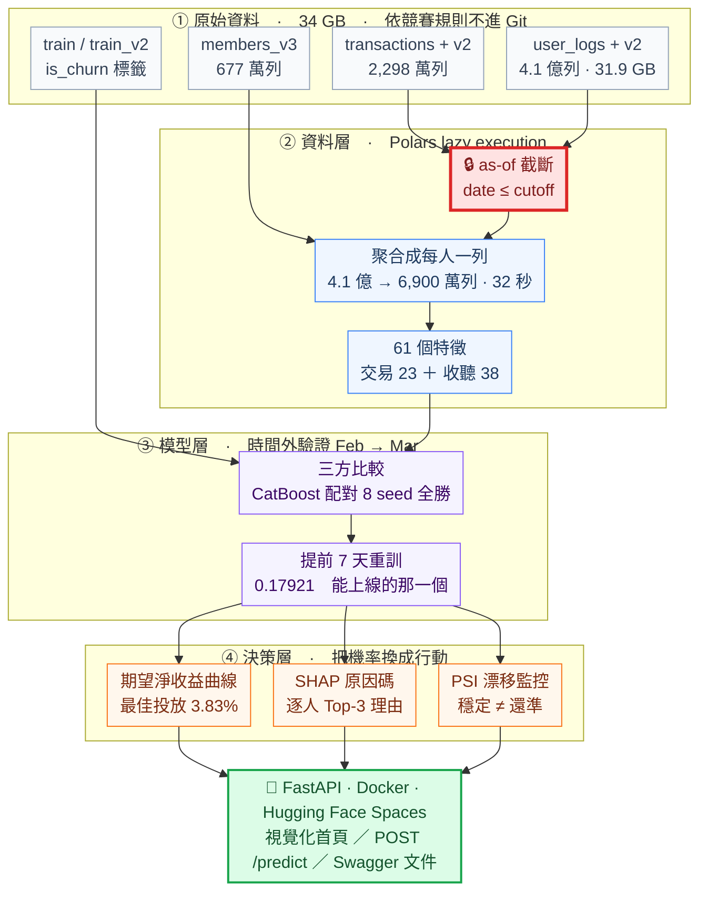

# KKBox 訂閱流失預測與挽回決策系統

> **這個月有 96.9 萬名訂閱者到期，挽回預算只夠發給一小部分人。該發給誰？**

**[▶ 線上 Demo](https://huggingface.co/spaces/lee851104/kkbox-demo)**　·　[API 文件](https://lee851104-kkbox-demo.hf.space/docs)　·　[完整發現](FINDINGS.md)　·　[模型卡](MODEL_CARD.md)

---

## 解決什麼問題

KKBox 每月有 96.9 萬名訂閱者到期，約 9% 不再續訂。挽回要花錢（送一個月免費，成本 150 元），而發給所有人一定虧 —— 大部分人本來就會續訂，優惠是白送的。

所以業務真正要問的不是「誰會流失」，是「發給誰才划算」。

| 交付物 | 實測結果 |
|---|---|
| **流失機率** — 每位到期用戶一個 0~1 的分數 | 時間外 Log Loss **0.17921**，勝常數基準 **41.2%** |
| **投放名單** — 由商業假設推導門檻，篩出值得投放的人 | 96.9 萬人選 **37,174 人**（3.83%），命中率 83.3%，期望淨收益 **NT$ 330 萬／月** |
| **原因碼** — 每個上榜的人，最多三句中文理由 | TreeSHAP 逐人歸因、加總恆等式逐列驗證；48,853 人、145,796 句候選理由全部可稽核 |

線上 Demo、`/predict` 的回應與報告裡的 0.17921 出自同一份 artifact（`catboost_lead7d`），不是三個名字一樣的東西。Kaggle 提交檔用的是固定評分日的另一份，因為競賽的評分時點不同 —— 每一筆回應都帶 `cutoff_definition` 與 `deployable`，講明這個機率是誰算的。

**資料集**：[WSDM – KKBox's Churn Prediction Challenge](https://www.kaggle.com/competitions/kkbox-churn-prediction-challenge)（WSDM Cup 2018）　**評分指標**：Log Loss

---

## Demo：一批到期用戶進來，誰該拿挽回優惠

[](https://huggingface.co/spaces/lee851104/kkbox-demo)

點圖進線上服務。輸入一位到期用戶，回傳的是機率、該不該投放、這一位的期望淨收益，以及最多三句中文原因碼 —— 全部即時計算。

---

## 用了哪些技術，以及為什麼

| 環節 | 技術選擇 | 選它的理由（都有實測支撐） |
|---|---|---|
| **資料處理** | Polars lazy execution | 收聽日誌 4.1 億列、31.9 GB，pandas 直接 OOM。日期過濾在讀取階段就 predicate pushdown 掉，收斂成每人一列（6,900 萬列、2.20 GiB）只花 32 秒 |
| **模型** | CatBoost（對照 LightGBM / XGBoost） | 同特徵同切分三方比較，CatBoost 勝 **2.16%**（7.69σ；σ = 0.00044 是實測的配對標準差，不是猜的）；反向驗證 Mar→Feb 與配對 8 seed 8:0 全勝確認不是雜訊。代價是慢 21 倍 —— 那是知道差距為真之後才做的取捨 |
| **特徵** | 61 欄（交易 23 ＋ 收聽 38） | 分組消融實驗逐組量增量貢獻。38 個收聽特徵只換來 1.38%，留下來的每一組都有實測依據而非直覺 |
| **可解釋性** | CatBoost 原生 TreeSHAP | 逐人 Top-3 中文原因碼，依語意分組避免同一件事講三次；加總恆等式逐列驗 |
| **決策層** | 期望淨收益曲線 ＋ 門檻 `p* = C_offer / (r_save × LTV)` | 把機率換成「發給誰」。門檻不看任何標籤，落點與實測最佳值只差 177 元（0.005%） |
| **服務** | FastAPI + Docker（Hugging Face Spaces） | `POST /predict` 單人、`POST /predict/batch` 一批人，機率與原因碼即時算，已上線 |
| **監控** | PSI 特徵／分數漂移 | 上線後拿不到標籤，PSI 是唯一拿得到的品質訊號。閾值先量過雜訊地板才判讀，盲區也一起記錄（見下方亮點 6） |
| **實驗追蹤** | MLflow | 每次訓練的參數、指標、模型版本都留檔，`make mlflow` 開 UI 看 |
| **工程品質** | pytest 385 條 · ruff · GitHub Actions | CI 強制 299 條純邏輯測試零 skip —— 因為一個全部 skip 的套件也會顯示綠燈 |

---

## 架構

從 34 GB 原始檔案到一個能回答「該投放給誰」的服務，中間四層。紅色那一格是防洩漏的核心。



紅框那個 as-of 截斷是全案最要緊的一步。標籤是「到期後 30 天內有沒有新交易」，而那 30 天的資料就在手上。任何跨越到期日的切分都會洩漏，所以每一欄特徵都只能由 cutoff 當下已經發生的事算出來。

`src/` 依這四層分成資料、特徵、模型、評估、解釋、服務六個模組，對應 22 個 `scripts/` 進入點。

---

## 工程亮點

**1. 八條防洩漏紅線，每一條都有一個「餵違規資料就 raise」的測試。**
標籤藏在資料裡 —— 到期後 30 天的交易紀錄就是答案。as-of 截斷讓每欄特徵只由 cutoff 前已經發生的事算出，M3 期間據此揪出並修掉 7 個洩漏風險，第二次洩漏審查再驗守門擋不擋得住。

**2. 一個 bug 讓所有分數都不可重現，於是把基準整個重建。**
cohort 列順序不固定，造成 0.7σ 的雜訊地板 —— 和想量的效果同一個量級。修掉之後 CatBoost 的優勢從 2.83σ 變成 7.69σ，M3 的結論直接翻轉；收聽特徵的價值則從 2.93% 腰斬到 1.38%。`make verify-rebuild` 驗證連續兩次強制重建逐位元相同。

**3. 提前 7 天評分的那一版，才是能上線的那一版。**
挽回優惠得提前寄出才來得及。把評分時點拉到到期日前 7 天重訓，模型看不到當天那筆續訂或取消，時間外 Log Loss 0.17921。代價用共同子集量得出來（`make lead-time`），上線和 Demo 用的都是這一個。

**4. 門檻由業務假設推導，不是「前 5%」。**
`p* = C_offer / (r_save × LTV)` 沒有看過任何標籤，落點離實測極大值差 177 元（0.005%）。同時明講三個假設的地位不同：`r_save = 0.15` 是**假設**不是估計值，敏感度熱圖給出它動起來的後果。

**5. 一個總分會蓋掉整群人，所以每次評估分三群回報。**
老訂戶流失率 5.87%，首次到期的新客 39.84%，差 6.8 倍。只看一個總分，等於把兩個完全不同的族群平均成一個不存在的人。

**6. 漂移監控連同適用邊界一起交付。**
上線後拿不到標籤，只能監控輸入與輸出分布。實作 PSI 並先量出雜訊地板（把參考期隨機切兩半算它自己的 PSI）再判讀閾值：分數 PSI 0.0254 是雜訊地板的 344 倍，而慣例說「穩定」，同期基準率動了 39.9%。所以寫進 `MODEL_CARD.md` 的不是「我們有 PSI 監控」，而是**PSI 比的是分布，「同一種人、行為變了」這類漂移要另一個外生指標接住**。

**7. 上線載到的一定是對的模型。**
模型、特徵欄序、業務假設打包成一份 artifact，載入時過三道守門：雜湊、欄位指紋、版本。存載容差 0。

**8. CI 綠燈要有實質內容。**
GitHub Actions 上沒有原始資料（依競賽規則不進 Git），而一個全部 skip 的測試套件也會顯示綠燈。所以 CI 分兩段跑：299 條純邏輯測試要求全過且零 skip，另一段跑全套件抓 import 與收集階段的問題。

---

## 快速開始

```bash
pip install uv && make setup                       # 環境（自動取得 Python 3.12）
cp configs/paths.example.yaml configs/paths.yaml   # 填上這台機器的資料路徑
make data                                          # 下載競賽資料（依規則不隨 repo 散布）
make test                                          # 385 passed · 0 skipped，約 85 秒
make train                                         # 訓練 ＋ MLflow 追蹤
make artifact-t7 && make serve                     # 匯出上線模型並起服務 → 127.0.0.1:8000
```

完整指令表 `make help`（34 個目標、22 個 `scripts/` 進入點，從 EDA 到 Kaggle 提交檔），各里程碑耗時見 [FINDINGS.md](FINDINGS.md#快速開始)。

---

## 深入閱讀

| 文件 | 內容 |
|---|---|
| [SPEC.md](SPEC.md) | 資料契約、驗證策略、八條紅線的完整定義 |
| [MODEL_CARD.md](MODEL_CARD.md) | 用途、⛔ 不可用於（五條）、機率的可信度、公平性缺口、監控與重訓 |
| [FINDINGS.md](FINDINGS.md) | 各階段的完整實驗記錄：特徵消融、模型比較、洩漏審查、決策層推導 |
| [reports/figures/](reports/figures) | 18 張圖：EDA、校準、期望淨收益曲線、敏感度熱圖、原因碼、PSI 漂移 |

**適用邊界**：本模型預測流失機率並據此排序投放優先度，**不宣稱優惠的因果效應**（那需要 uplift modeling 與 A/B 實驗，本資料集沒有實驗組／對照組結構）。也不可用它決定優惠金額或任何差別待遇 —— 模型吃了 `gender_code` / `bd_clean` / `city`，而本專案尚未做群組公平性評估。完整的用途與限制見 [MODEL_CARD.md](MODEL_CARD.md)。

---

## 授權

程式碼 MIT（見 [LICENSE](LICENSE)）　·　資料 © KKBOX Group，依 [WSDM Cup 2018 競賽規則](https://www.kaggle.com/competitions/kkbox-churn-prediction-challenge/rules)使用，未隨本 repo 散布。
